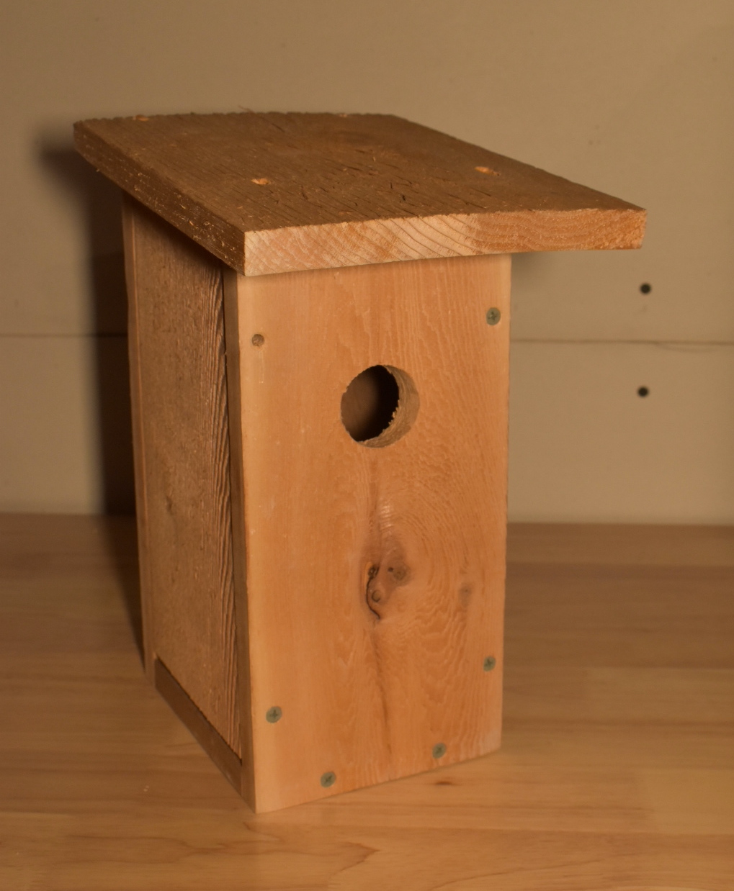
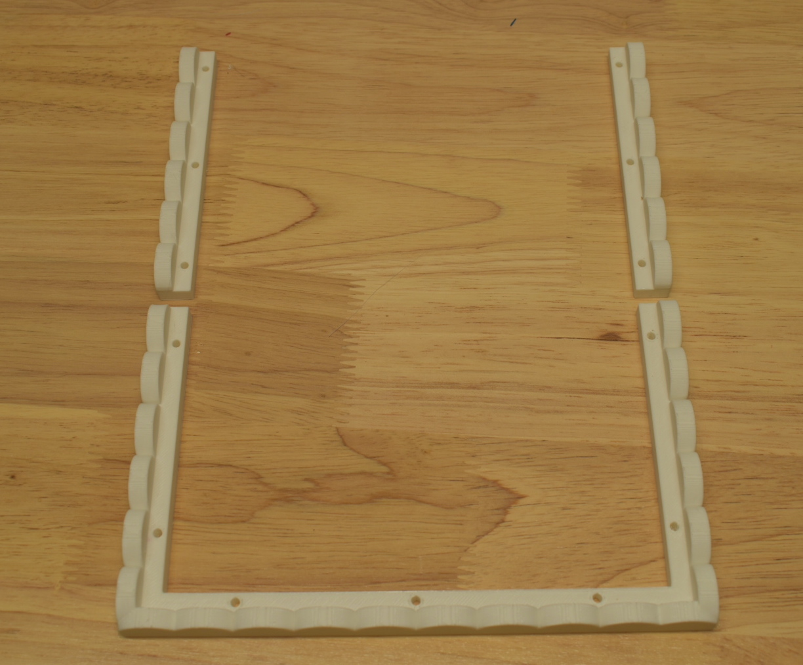
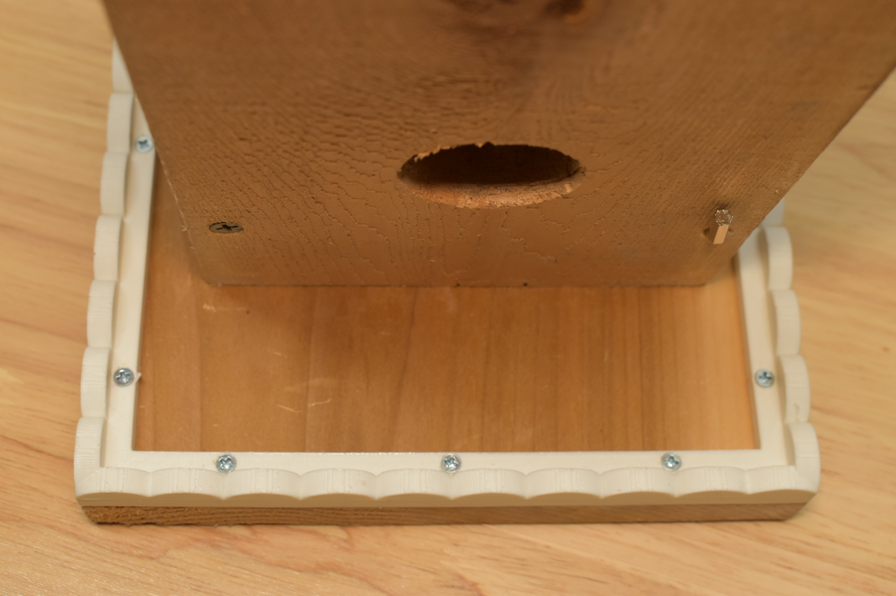
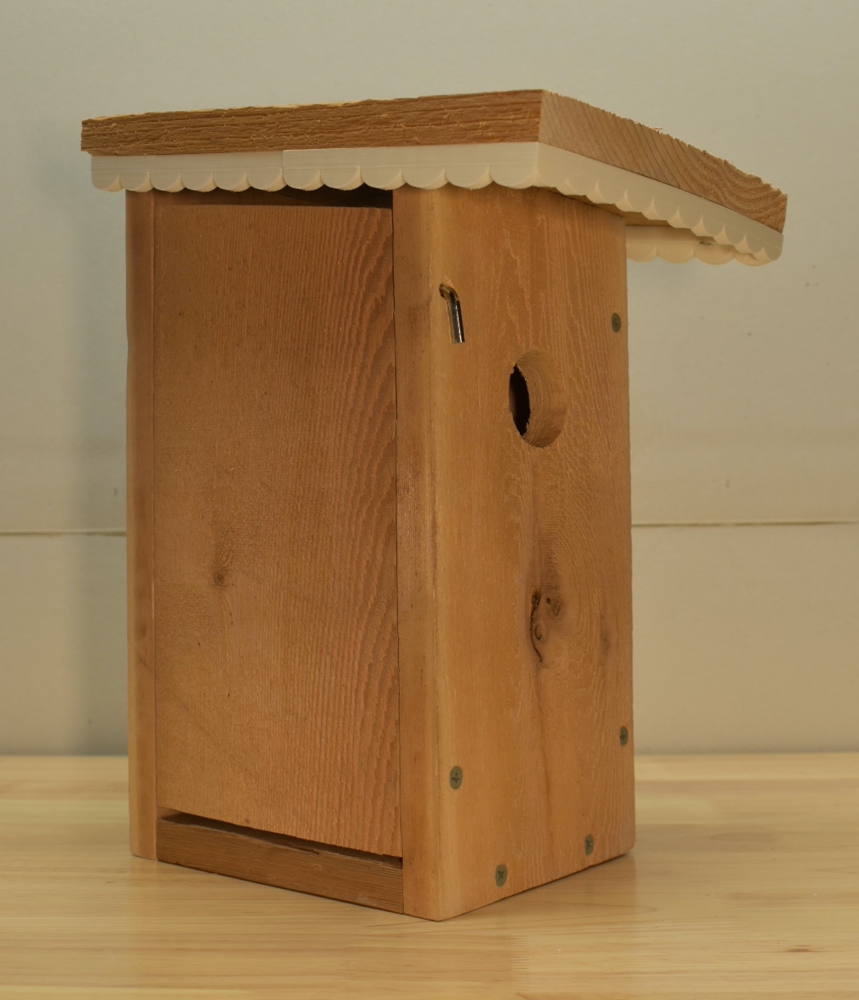
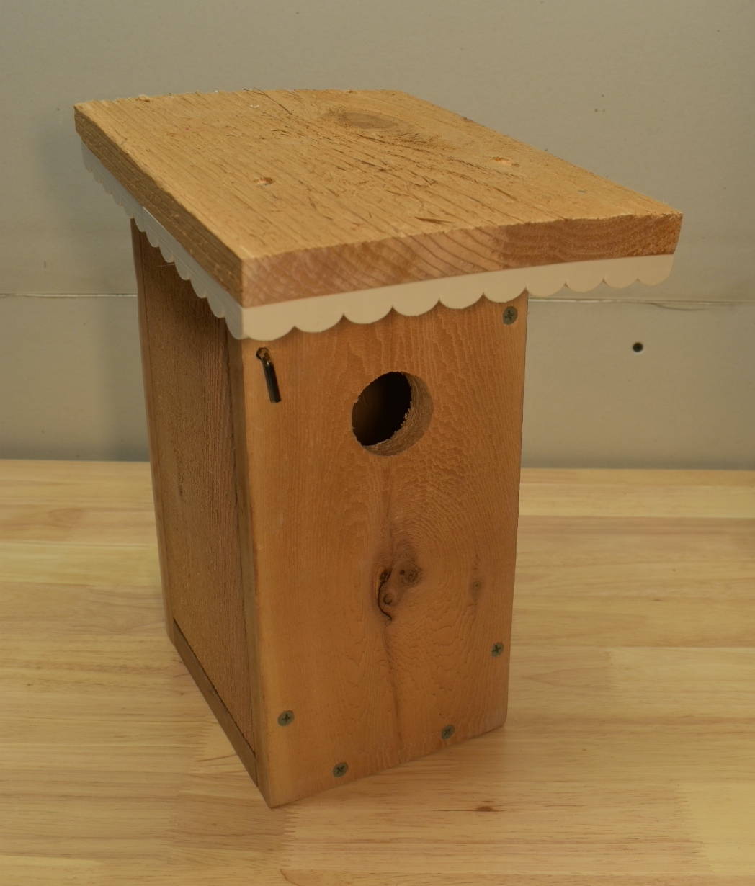
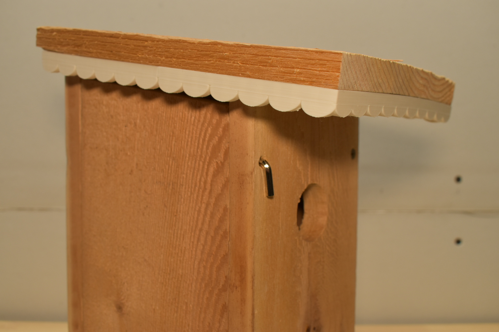

---
title: "Eastern Bluebird House with 3D Printed Trim" 
date: "2026-01-04"
resources:
- name: featured-image-preview
  src: "bluebird-house-5.jpg"
---

I recently built an Eastern Bluebird house. I used plans shared by the Oklahoma State University Extension Office, using their ["Plan A" (Simplicity) design](https://extension.okstate.edu/fact-sheets/print-publications/hla/three-designed-birdhouse-plans-for-eastern-bluebirds-hla-6471-a.pdf) with 3/4" cedar boards. What I thought may be helpful in sharing was the 3D model design I created for having some white trim added to the roof of the house. I thought it would be nice to add a little character to the house, and we previously had a cottage house that has this type of looking trim. So, I thought I would share this if you also have bluebirds in your area, and are looking to provide them with a new home that has some charm.


  


## 3D Model

You can check out the model on TinkerCad here:



Printing this model out (white PLA material) will include three pieces:
* Front-trim that wraps the corner
* Two side edges

_Note: Instead of just one solid piece of trim, I broke it up into the front and two sides so it can easily fit on the 3D printer build plate._

## Attaching

The model has holes to make it easy to then pre-drill holes for #4 fasteners (using 1/16" straight bit). You can then stand the house upside down to drill the pilot holes and add the fasteners.

## Finished

With the trim added, I think it gives the natural cedar look a nice added detail, without it being too distracting on the house.


  
  
  


Hope sharing this example (using the [Oklahoma State University Extension plans](https://extension.okstate.edu/fact-sheets/three-designed-birdhouse-plans-for-eastern-bluebirds.html)) with the model for adding some trim on your house, gives you something you can build for your birds!
