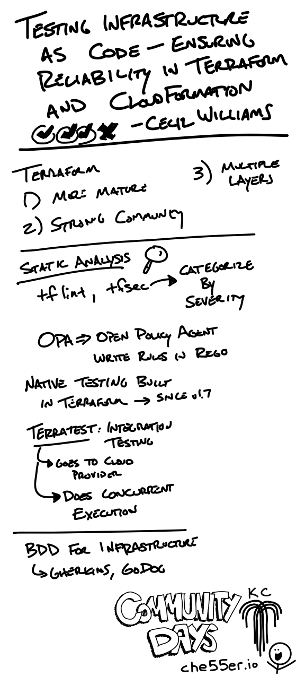
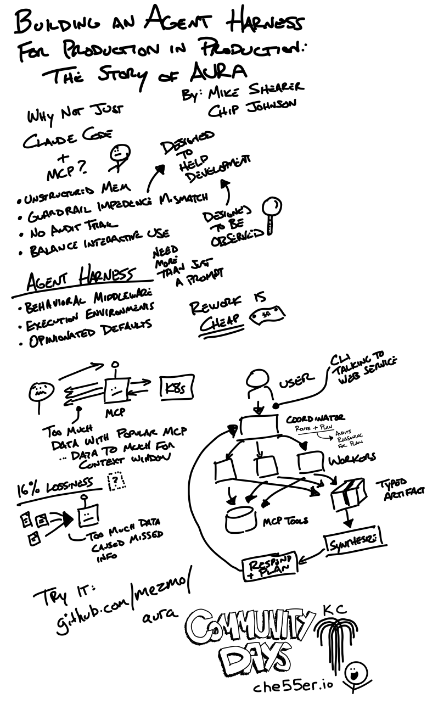
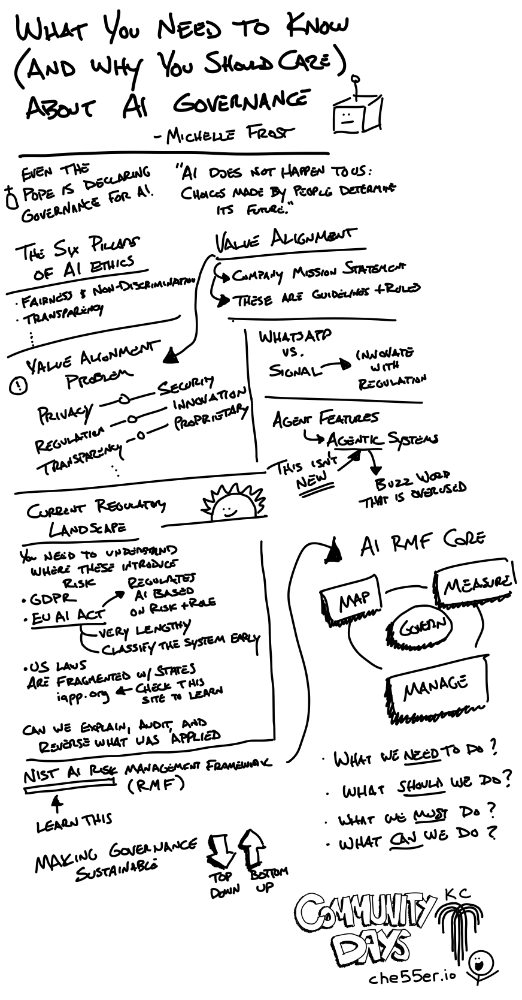
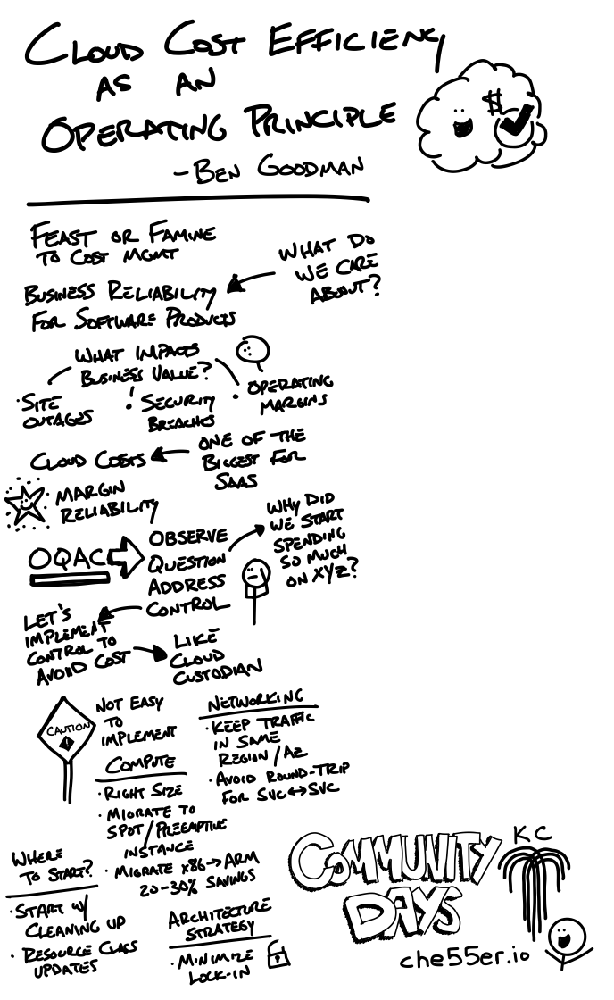
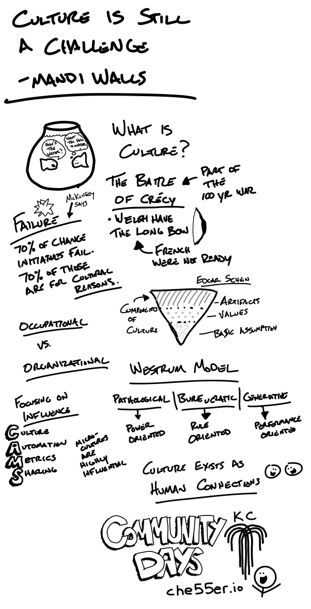
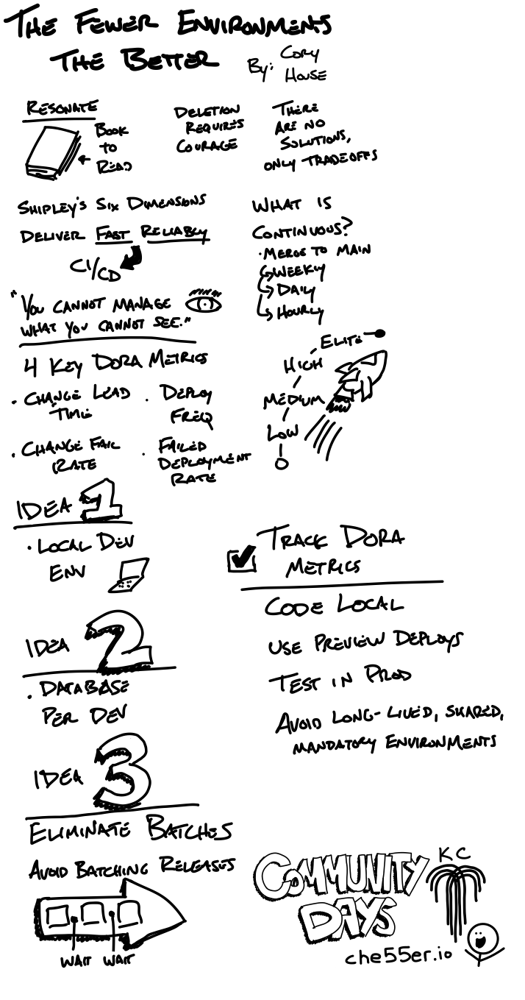
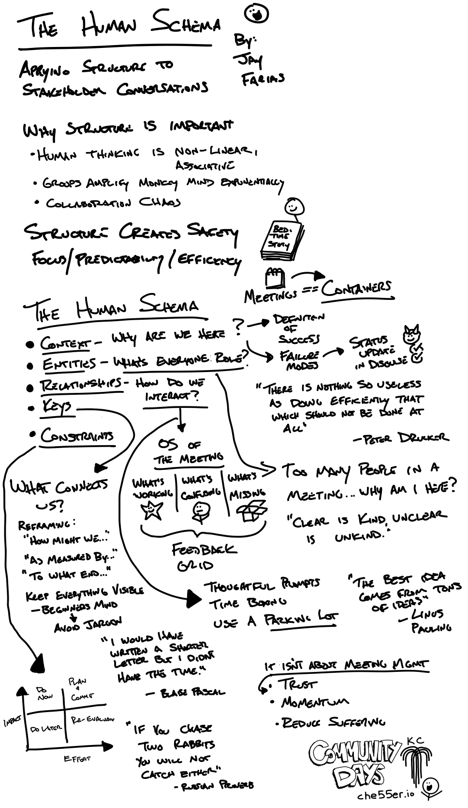
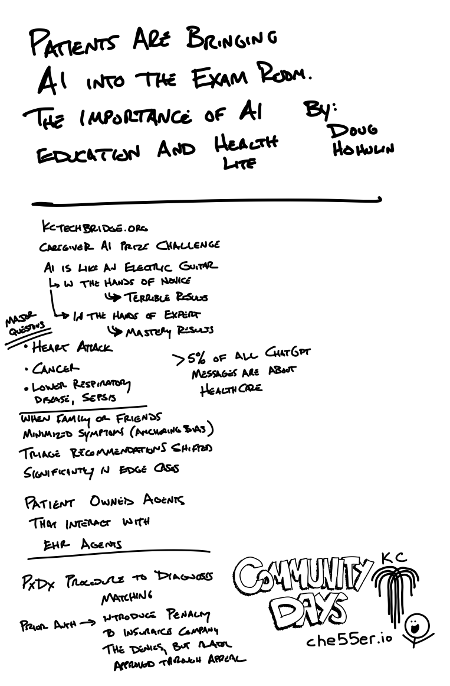

This was the inaugural year of CommunityDays KC. The conference was connecting multiple different technical communities / meetups across Kansas City in a two-day event. It was hosted at Lifted Logic’s office space, which was a neat location - had a larger community room on the lower level, with several rooms for different sessions. Adam Fichman, the founder of Lifted Logic, kicked off the event with a quick talk on his background and the analysis of understanding the value of a customer, and the costs of acquiring them. I noticed he has done a [TEDx talk](https://www.youtube.com/watch?v=nV4IDyqQfyA) before, which hits on some of the similar elements on the value of a customer and analysis on getting conversion for site visitors. Check it out!

What I enjoy most about these conferences is connecting with people. Often, I get to see people I haven’t seen in a while - either since a past conference or a previous team I worked with. Often, in that same time of reconnecting with past colleagues, you also get to meet their newer team members - learn what they are facing, and what they are doing to address it. Its a fun way to quickly reconnect and grow your connections. 

## Notes

When listening to talks, I often try to take notes to help me keep focus on what are the key items being shared. I do this intentionally with handwritten style notes, as I can emphasize things quicker with visualizations that assist with my memory. These notes can sometimes be quite hard to read, but I have found myself going back to them when recalling a topic that I know was from a conference. Here are some of my notes here which were larger in size.


  
  
  
  
  
  
  
  



## My Talk

While I attended talks, I was also a speaker for two talks, here are the links to the slides:

* [A Practical Guide to JVM Native Memory in Kubernetes](/talks/guide-to-jvm-native-memory-k8s/): A quick talk (15 minutes) on how to understand and measure the native memory usage of your Java workloads running on Kubernetes.
* [What HTTP Can Teach Us About Better Human Communication](/talks/http-human-communication): This is a 5 minute lightening talk, that is 20 slides, that advance every 15 seconds. These can be a challenging presentatino, but they are always fun to do!
