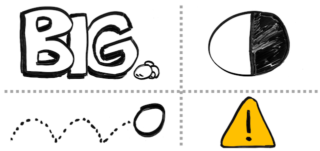
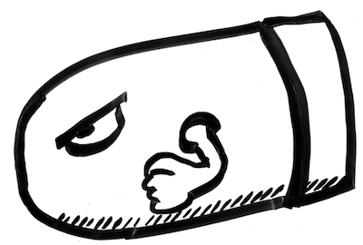

## The _pptx_ Language

A few months ago, I was speaking with a senior member of our engineering leadership team, and he stated that the only language he has been coding in lately, is _pptx_ (referring to the file extension of [Microsoft PowerPoint](https://products.office.com/en-us/powerpoint)). While this statement was delivered with humor, I found it to be true with many engineers. As they grew with experience, so did the amount of time they spent giving presentations. By presentations, I simply mean sharing or pitching their ideas to larger audiences (their team, group, organization, or even the entire company). With this increase of sharing ideas, they many times are also working on presentation material (i.e. slides), which is often considered an unpleasant activity. I have noticed this in my own career, where I am routinely spending time building presentation material, which doesn't deliver the same feeling of joy as compared to writing code. However, as I have spent a extensive amount of time both building presentations and witnessing them, I find these to be a powerful moment where you can help inform and learn from your technical ideas.

In this short post, I will share some guidance I have gotten on building presentation slides. This guidance can serve as some design principles when dealing with the _pptx_ language. My ultimate hope is that these are specific enough where you can easily apply the guidance, but general enough to not constrain how you share it. A primary source of this content comes from David JP Phillips's TED talk of: _[How to avoid death By PowerPoint](https://www.youtube.com/watch?v=Iwpi1Lm6dFo)_, so definitely check out his talk, he can describe several of these points better than I.

## Slides: The Visual Aides

When seeking how to improve my presentation skills, I would often find things which were implementation details of using a specific presentation software. All to often, we get caught up in the features these editors ([Microsoft PowerPoint](https://products.office.com/en-us/powerpoint), [Google Slides](https://www.google.com/slides/about/), [Apple Keynote](https://www.apple.com/keynote/)) offer, but rather lose sight of what we want to use them for: a visual aide. When you are presenting a topic to a group of people, your slides can serve as a significant influence in how well they remember your content. Furthermore, they dictate how well you can ensure they even pay attention, and follow the order in how you want your content digested.

Your slides are intended to be your _visual aide_ in the presentation. **You** are the presentation, not the slides. You want to leverage the slides on how to control the audience's focus and improve how they capture your ideas. So, we will focus on the essence of the visual aides, and not the implementation details of using these tools.

## Human Attraction

When building visual aides, recognize what we humans are attracted to:

* Big things
* Things in motion
* High contrast (ex. black on white)
* Signal colors (ex. yellow, red, green)

It is important to understand these basic attention getters, as you want to leverage these in controlling your audience's focus. Therefore, there are a few things to remember which these factors can contribute problems in your visual aides:

* **Unintentional sizing**: Typical slide templates have the headline at the top, which has the largest font size. The headline is then used to just list a category for the slide, and therefore the element which has the most attention due to size (the headline), is generally the least important element of content.
* **Unnecessary motion**: Having unnecessary animation or motion on the slide, that isn't being used to guide the audience of what they should be looking at currently, but rather to make it look "neat."
* **Excessive color**: Having many different signal colors included with imagery, which draws your attention, but the imagery doesn't strongly correlate to any messaging. As a result, your audience doesn't remember what message was being shared to trigger the image. The image might look colorful and amazing, but that doesn't assist in helping the audience capture the message.

## Watch out for Bullets

As you are probably aware, most presentation software has templates for your slides, and in several cases these templates contain elements that lure bad behavior. One of these bad behaviors is bullet points. I use bullet points all the time to provide a listing of discussion points (like this blog post), but in a visual aide, you have to be mindful in how you share them. Here are a few things to be mindful about bullet points in a presentation...delivered via bullet points 😀:

* **Amount of content**: When you show a bullet list to an audience, it can quickly be overwhelming if there are many points shared all at once. You also lose your audience's focus as you are talking if too much is being shared in that one moment. Rather than sharing it all at once, limit how much you share as you are talking. For example, visually grey out content already shared, and highlight/bold what you are currently talking about in the list.
* **Size of font**: When you include more bullet points for a listing of content, most presentation software automatically handles this by scaling down your font. The more you reduce the size of your content, the more you are reducing its importance to your audience (remember, we notice big things). Rather than reducing the size of your font, reduce how many bullet points you share per slide. Strive to keep the total amount of objects to six per slide, and each bullet point is considered an object.
* **More text will result in less imagery**: We are visual creatures. As mentioned earlier, you want to limit the amount of objects that are on your slides. Bullet points of text quickly take away the placement of visual imagery that could improve the attraction or ability for someone to remember the content. Reserve one of your objects you share as an image, and don't exclusively show bullet points on slides.

## Distraction for Nothing

As we have briefly covered what humans are attracted in your visual elements, be reminded you don't have to distract them with content. Here are a few tips to minimize distracting your audience for _nothing_:

* **Don't feel compelled to have a title on the slide**: I strongly value consistency of style throughout a presentation, but that doesn't mean you need to have a large banner of text at the top of your slides which just lists a category. You can still include a title / category on your slide, but it could be smaller text at the footer, to help provide context for the audience. It isn't required, so don't feel you must have it unless the context is useful when quickly viewing your slide.
* **You don't always have to show something**: These are visual aides, it is perfectly fine to have your next slide be a black background (nothing to see). As you continue to talk, your audience will then simply direct their attention solely to you. Note, be sure to do this at a point of a transition, not "randomly" while you are talking. If it doesn't seem like a transition, they may think something is wrong with your visual aide and then try to contact you to make you aware of the situation ("Uh, Bill, your slides aren't showing..."), which creates a distraction.
* **Avoid leaving slides up with high attraction power, and little needed content**: I have seen presentations with a bright white background, and simply one word on the slide, that's like "Hello." People continue to stare at this slide as the person introduces themselves. It like this slide is drawing them in, well beyond the time necessary to read the single word. One alternative to having this type of slide, is to not show anything at all (black screen), so everyone looks at you as you introduce yourself. A second alternative, is to have an image, which strongly represents you and quickly creates a memorable moment in your audience. Remember the intention of your visual aide, and don't allow it to steal one of the sensory units of your audience (their eyes) by not delivering any part of your message.
* **Using animated memes unnecessarily**: We all fall victim to wanting to include something entertaining, but I have seen cases where someone thinks it would be good to include some animated GIF that references a funny meme in the corner of their slide, which is right next to the main points they are sharing. This results in people being distracted by the entertaining loop of the video, and not capturing what you are saying. While I definitely enjoy some fine animated memes, deliver them in isolation and don't allow them to linger long as you share your message.

Be mindful of what you include, and recognize its strong ability of distraction.

## Visual Imagery

When adding visual imagery to your slides, it is easy to find yourself wasting time shopping for unnecessary clipart that relates to your idea. While I believe images are powerful things to include with content that can improve what your audience remembers, it can also be a pain to find valuable content. Something I have found helpful in doing visuals is using my own illustrations for slides. Here are some benefits of doing this:

* **Uniqueness**: When using your own drawings, they are very unique. That uniqueness helps in how people remember your content. Also, the element of novelty with your drawings also improves attraction to the imagery. Knowing you don't want the image to be distracting for your points, you can make the image custom to what you want to share.
* **Simple**: Don't think you need to be a great artist to do this. Simple sketches can really be powerful in what you are describing. By focusing on a simple image, you will be amazed how quickly you can illustrate something that doesn't need to be complex.
* **They naturally leverage contrast**: Simple cartoon illustrations have a great element of contrast (black on white), which is easy to see and has strong attraction powers. You can then consciously choose to inject color where you may want to bring awareness or highlighting a point. Do not think you need color on your images to make them effective.
* **Feels _human_**: When I share my drawings, or see illustrations from others, there is this basic human element that is exposed in the image. By the image not being perfect, but being original and authored from the individual, it seems more authentic and _human_. So much of the images online or in generic presentations appear unreal or edited , and don't seem authentic to who is sharing the message. When the image is authored by you, it brings this added element of authenticity, regardless of how good or poor the image looks.

I plan to do a [future blog post](/post/drawing-101/) of how I started doing my illustrations in a very low-fi way, to show that it can be easy to start and you shouldn't be afraid to try. Note, I realize that several people may think they are not good at drawing, and these points wouldn't work for them. That may be true, but I would at least try it first. I didn't think it would work well for me either, but once I started doing it, it actually made me enjoy doing visual aides, as I like practicing to draw.

## Summary

I hope these basic design principles of the _pptx_ language are helpful. The goal is that you focus on the message you want to deliver, and recognize how visual elements can assist or hinder this. Don't feel like every moment needs something on a slide, and don't fall victim to common presentation templates that invite distractions from your primary messaging. Remember, **you** are the presentation, and the slides are simply an aide in doing so.