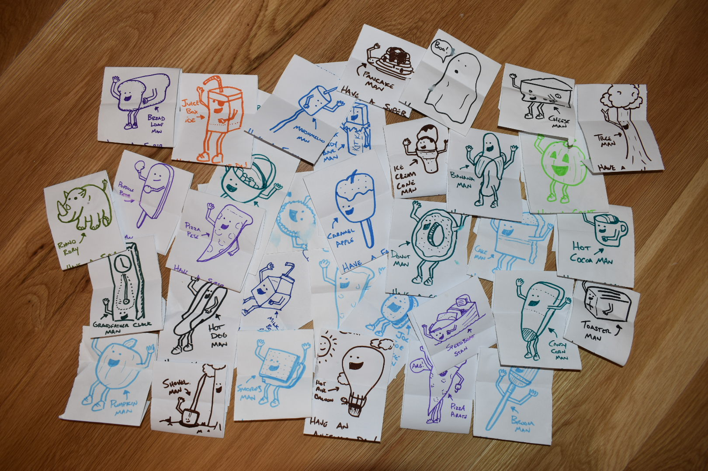

Over the last year, I have found myself trying to establish new routines. With working more from home, I wanted to make subtle changes in different aspects in my life. For example, I previously used to enjoy podcasts on my drive to work. Now, I focus on listening to these while I do chores around the house. In this blog post, I will share how I found an effective way of establishing a new habit through something simple which happens to have science behind it. I hope this is helpful if you are looking at ways to be effective in new habit building too.

# The Habit

I wanted to practice drawing more. By drawing, I mean making simple cartoons. I'm not great at drawing, but I have found that the more that I do it, the better I get. Especially, when I try to draw things on the fly (i.e. when taking notes), by applying common things I have drawn before. I also found it to be a great way to allow my mind to focus on something else while building a skill (drawing). Anway, that was the habit I wanted to establish: draw more.

# The Approach

I decided that I wanted to draw something different everyday for my kids. These would be part of their note that would be in their school lunch. I found it hard to make a new message everyday, but it seemed like a good practice in trying to draw something new. I also feel like cartoons are a universal way of communicating. A simple picture, that doesn’t require too much detail, and can itself be entertaining without any words.

When deciding what to draw everyday, I wanted it to be simple. More specifically, to be approachable for me to do each day. I didn’t want to require an extensive amount of thinking, but enough where it would challenge me to come up with something new. I mean, who would want a lunch note with the same picture everyday!? 😄 Finally, I wanted to have some common elements so it was easier for me to practice the same type of drawing, but also allow it to be different.

I decided that I would draw a character, that would be something different each time. These ended up having a likeness to [Mr. Peanut](https://en.wikipedia.org/wiki/Mr._Peanut) or [The California Raisins](https://en.wikipedia.org/wiki/The_California_Raisins) (oh, how I loved their TV specials as a kid). As a result, I would make banana man, apple man, etc. These would also include a message, but the messages didn’t vary too much, a greeting and sharing something positive about the day (“Happy Tuesday! Have a great afternoon!”).

# The Frequency

By having the habit applied to an existing routine (school week), it was a healthy dose of doing something consistently. However, you also had a few breaks with the habit. This included weekends, holidays, and school breaks. Having some breaks known upfront, helped me practice stepping away and returning with my habit. While this was a somewhat simple task, I realized that I probably wouldn’t be the best at following it if I was expecting myself to do it every day of the year. I then found myself establishing a set time, after doing dishes, to do these drawings. Sometimes when this anchor period didn’t occur (doing dishes), I would almost forget to do the drawings, and would scramble to do them in the morning.

When things would get busy, I would find myself getting quite quick at making these. This is where I felt it helped me improve in other cases, like notetaking, where I wouldn’t spend too much time on detail and would accept mediocre quality since it was understandable enough in what it was illustrating. Applying common things together for a drawing, since I was doing it often in other illustrations.

_Found these packed away in my kid's bag from past lunches._

# The Trick

What I found powerful about this habit was associating it with my children. If I didn’t do the drawing, I could visualize my kids being saddened as they open their lunch and not finding a note they were expecting from their parents. I felt obligated to do these notes. In habit building, this is often an effective tool in having accountability. For example, when establishing a new exercise routine, it works great to have a friend join you to make you accountable - you wouldn’t want to leave them waiting for you at the gym. 

What felt different out of this, is that I constructed this accountability. I’m quite certain there are days my notes go unseen. I know this, as I ask them routinely who was in their lunch, and the answers aren’t always accurate. My kids aren’t having to do anything to make me accountable, besides being someone I deeply care about. Meaning, I’m not asking them to do something to be my accountable counterpart in this habit building. This was working for me, without really asking anything of anyone else.

As I have read more about habit building, something emerged in this approach that resonated with me. It is how I treated this goal as an obligation, rather than a desire. Tory Higgins, a professor of psychology and business at Columbia University, [describes the differences goal effectiveness](https://www.marketwatch.com/story/want-to-be-happier-or-slimmer-in-2016-read-this-2016-01-05) that are promotional or preventional. Promotional goals are ones that describe a hope or desire that if I do my goal, I will earn this desirable thing. Conversely, preventional goals are ones that I will have to do, otherwise something will happen. In my case, I was framing my habit as a preventional goal of doing a drawing for my kids for their lunch, otherwise they may be saddened or felt forgotten. By doing it once, I established the status quo, where my kids expected a note. Now, if I don’t do it, I could be disappointing my kids. For the record, I’m quite certain they wouldn’t realize a day or two, but I’m not going to risk that!

# Conclusion

This last part is something that I thought was interesting and thought it was valuable to share. Framing your goals as a preventional goal can help make it stick. In my case, I established a status quo with my children on doing something I wanted to do more of: drawing. If you are looking for ways to build new habits, consider things that are important in your life and how an initial step can establish a status quo that you want to preserve in supporting that important thing. This preventional goal framing can really be effective in sustaining an activity that can also bring desirable gains.

