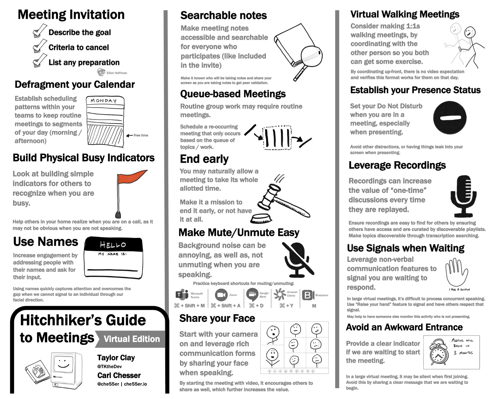

Two years ago, I worked on a guide that I called the _[Hitchhiker's Guide to Meetings](/guides/hitchhikers-guide-to-meetings-11-17.pdf)_. This guide highlighted many of the lessons I had learned over the years involving meetings at work. I have found having this guide to be a helpful reminder on things to continue to practice with the goal of optimizing time in meetings. With this year's change of virtual meetings being the primary means of engagement, I wanted to make an update to this guide to highlight some of these newer lessons with the virtual format.

In this blog post, I wanted to share the additions to the guide with some added background information. This will also include referencing some of the original content, and its importance with virtual meetings.

## Searchable Notes

During a meeting, I find it important to capture notes in a shareable location. A shareable location would be anywhere that others can also access and quickly locate the content (Microsoft OneNote, Google Doc). Make it known where they can find the notes by sharing the location (ex. link) in the meeting invite. This is helpful for other invitees who may not know where the team normally keeps their notes, or if the meeting is picking up from an earlier set of notes. 

Early in the meeting, it is helpful to identify who is taking notes to simply avoid duplicate efforts from occurring. With virtual meetings, I find sharing my screen while taking notes to be the optimal way of collecting information. Like [pair programming](https://en.wikipedia.org/wiki/Pair_programming), you instantly get feedback (additions, corrections) as you are taking notes. By establishing who is taking notes and sharing the screen while taking notes, you can achieve a rich single set of notes that others can leverage.

By instilling good hygiene with note taking, you can transform what might just be a one-hour discussion into an effective working session which is building a documentation product that can be reused with others. This makes it a reliable way for team members who were not able to make it to the meeting to stay connected on the topic and reduces the need of attendees to replay the discussion for others.



## Avoid an Awkward Entrance

With a larger virtual meeting, it can sometimes lead to an awkward entrance when you are allowing a few minutes at the beginning for others to join. This is because when people start to join, they may just see others in the meeting, but recognize nothing is being shared. After waiting with silence for sometime, someone may ask "Are we waiting for someone to start?" The host may then state "Yes, we are waiting for a few more to join before we get started." After this is shared, the next set of people join, which then enter a meeting of more people, yet they don’t see or hear anything. They may then ask the same question as the earlier attendee, and then the host repeats what they stated earlier.

You can solve this problem by just having something shared on the screen at the beginning of the meeting, like "We will be starting in a few minutes…" This doesn’t have to be anything fancy, but should be an obvious message that can quickly establish context as people join the meeting. They won’t have to ask if we plan on starting soon or having the host repeat stating the same message after each wave of attendees join.



## Share your Face

Human beings have a strong attraction to seeing another human face when speaking. It is a rich communication form, as there is an abundant amount of information being exchanged beyond just words. Facial expressions can quickly convey many other non-verbal queues that would otherwise be lost if you weren’t able to see the other person’s face. So, when joining a meeting, join with your camera on. It invites others to do the same thing, and it maximizes your communication time.

Working at home, it is understandable that things may not seem as presentable, which may be your reason for not wanting to share your video. However, I have found that when I’m in a meeting where others are more relaxed in what they are sharing (and not caring what their hair may be looking like that day), you get a more enjoyable and effective moment of communication. It’s real and shows your willingness to be open to communicate with others in that rich setting, agnostic of any small imperfections that you could believe would hinder the aesthetics in how you present yourself.

Finally, by sharing your video, you can get other effective information points that are beyond what is being spoken. For example, when someone steps away from their desk, you can clearly see they are not there and therefore you do not need to wait in an awkward pause for them to respond. If you know you will be moving around and it wouldn't be advisable to share video, I find it helpful to just share that in the chat before the meeting (or send an email to the attendees). This helps with additional context, that you may only participate in the meeting by listening. It further reminds people that you still want to meet, but are unable to achieve your default expectation (by meeting and sharing your video).

Make sure you share your video, as when you do, it invites others to do the same which can further enrich the quality of communication.



## Use Names

With virtual meetings, you lose some of the communication queues that can occur when you are speaking to someone. When you are in the physical presence of someone else, you would normally face them when you are speaking to them to quickly indicate they are the intended audience of a specific message. When you are in a virtual meeting, it is like you are facing everyone. To help capture people’s attention, I find it extremely helpful to preface statements with people’s names (much more than you would normally).

When you use someone's name, it quickly captures their attention. Through its use, it also helps give guidance to others on who you are expecting to provide a response. Practice referencing peoples names, it is an effective means of capturing attention and giving an indication to the group of who you expect should respond.



## Virtual Walking Meetings

As I have mentioned earlier, it is valuable to share your video, but that can limit where you have meetings. For me, I routinely have 1:1s with others, and used to make these walking meetings when we were physically at the same campus. I thoroughly enjoyed being able to go out and walk and talk with others. That is still possible with a virtual meeting, by simply checking with the other person if they would be interested. This can then help inform them, that it is OK to not share their video and there won’t be anything being shared on the screen, just a time to walk and talk. 

When I have done these, I have found some things work well, and some things require some additional adaptations. For example, I walk with a notepad and a pen, so I can take notes for things I want to follow-up on, but of course these are very brief things I write down as I’m not the greatest at writing in a notepad while walking (I’m already multi-tasking by walking and talking, I think I’m doing pretty good already 😄). Also, talking with someone over the phone while walking can have more audio problems (ex. the wind) than when you are in person. However, the few challenges I have faced in doing this have all been minor, and the benefits have always been greater than the cost.

Finally, I find doing walking meetings work best just for 1:1s. While I’m sure you could make them work for other meetings with more participants, I just find it not to be as effective, at least when you plan to be an active participant (vs. maybe just listening in). I either am trying to look at my phone more while walking to see who is talking or I’m wanting to look something up that was mentioned, but it isn’t as convenient on my phone when walking. Therefore, I just keep it simple and try to apply this practice with 1:1s.

If you haven’t tried this approach, I recommend at least trying it. If the colder weather is keeping you from going outside, I have even done it while walking in laps in my basement. It feels good to move around, and you may find it also helps your mind as well.



## Conclusion

I hope these points help further explain some of the additions I have recently made in the virtual edition of the guide. Feel free to check out my past talk on the [Hitchhiker’s Guide to Meetings]() to learn more about the other points I share in the original guide and what has been carried over into the virtual edition. I would be curious to hear your thoughts on what other lessons you have found valuable in being effective within virtual meetings. 

Please, [send me an email with your thoughts](mailto:cchesser@gmail.com), I would love to include other ideas into the guide to further improve it. 

