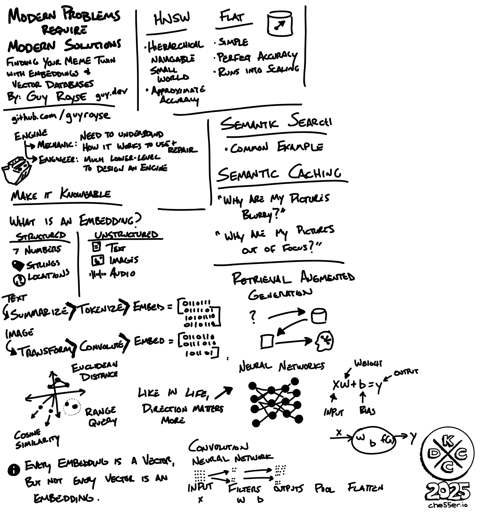
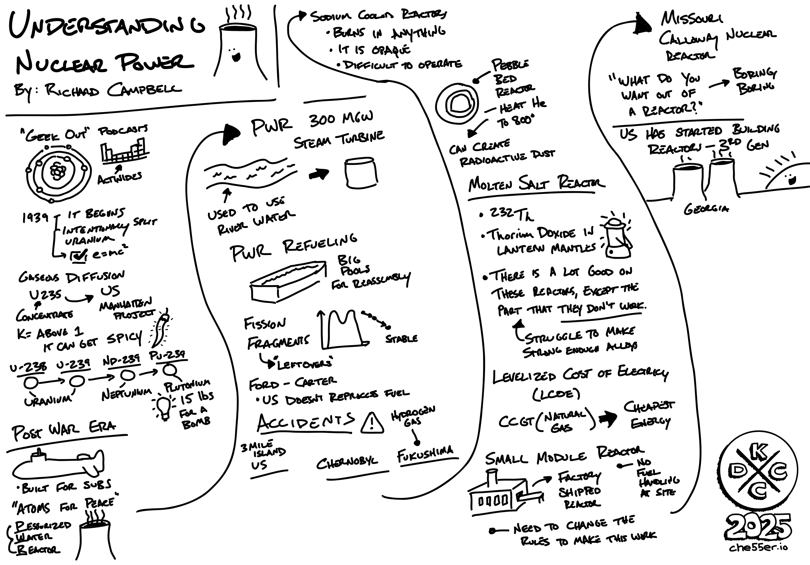
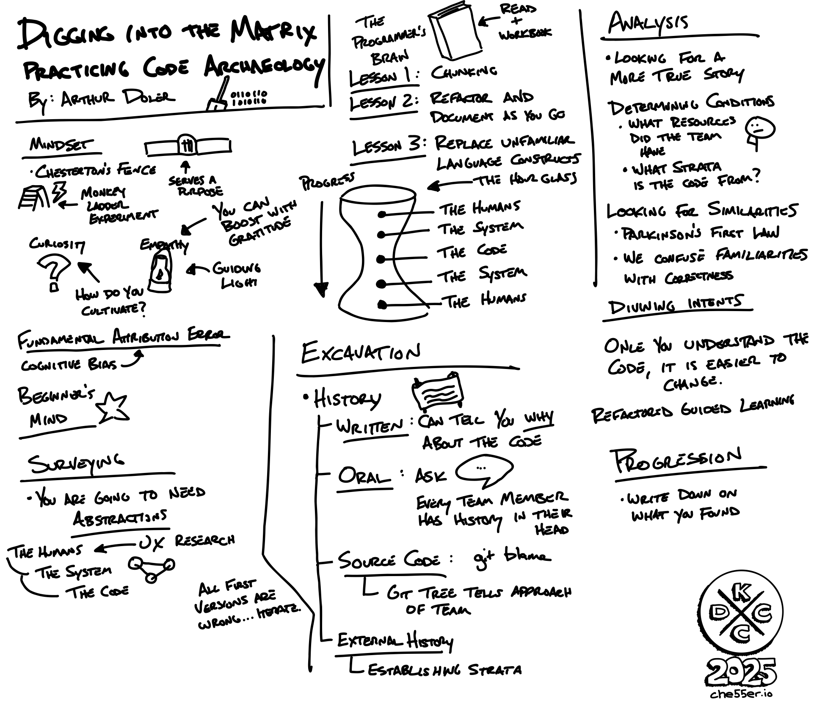
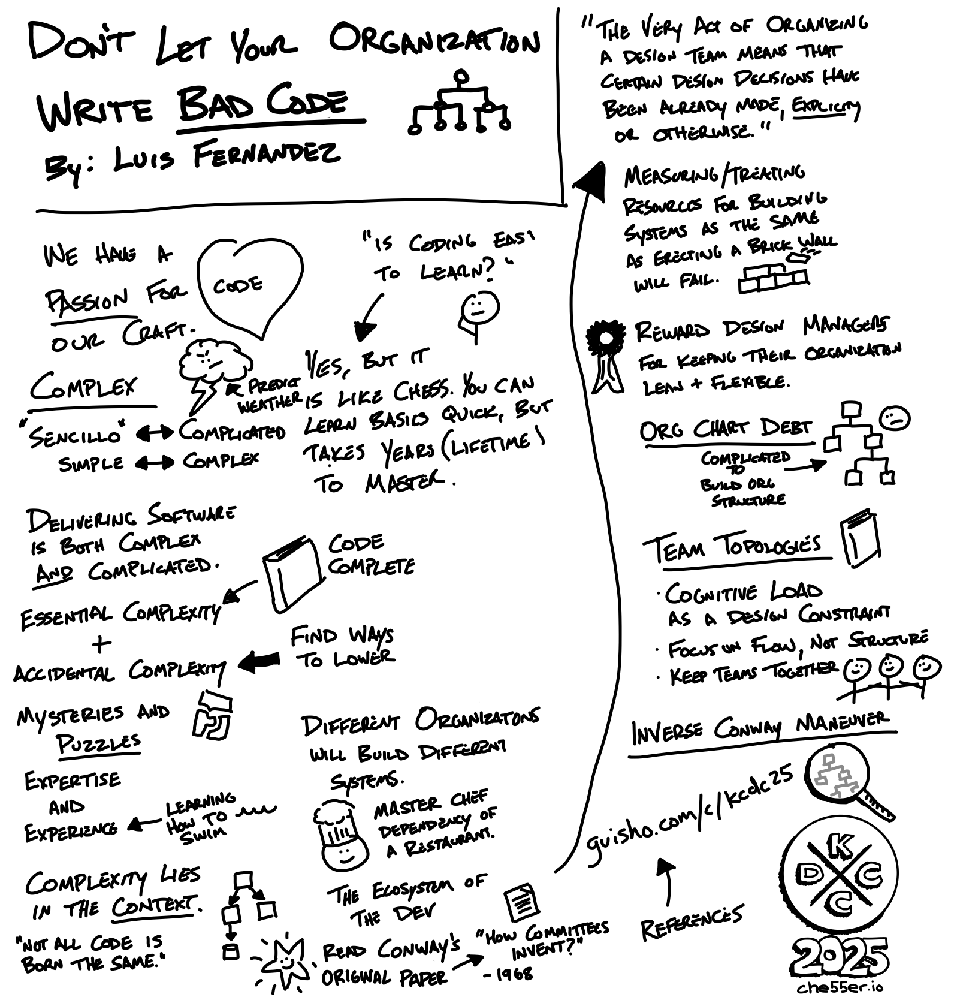
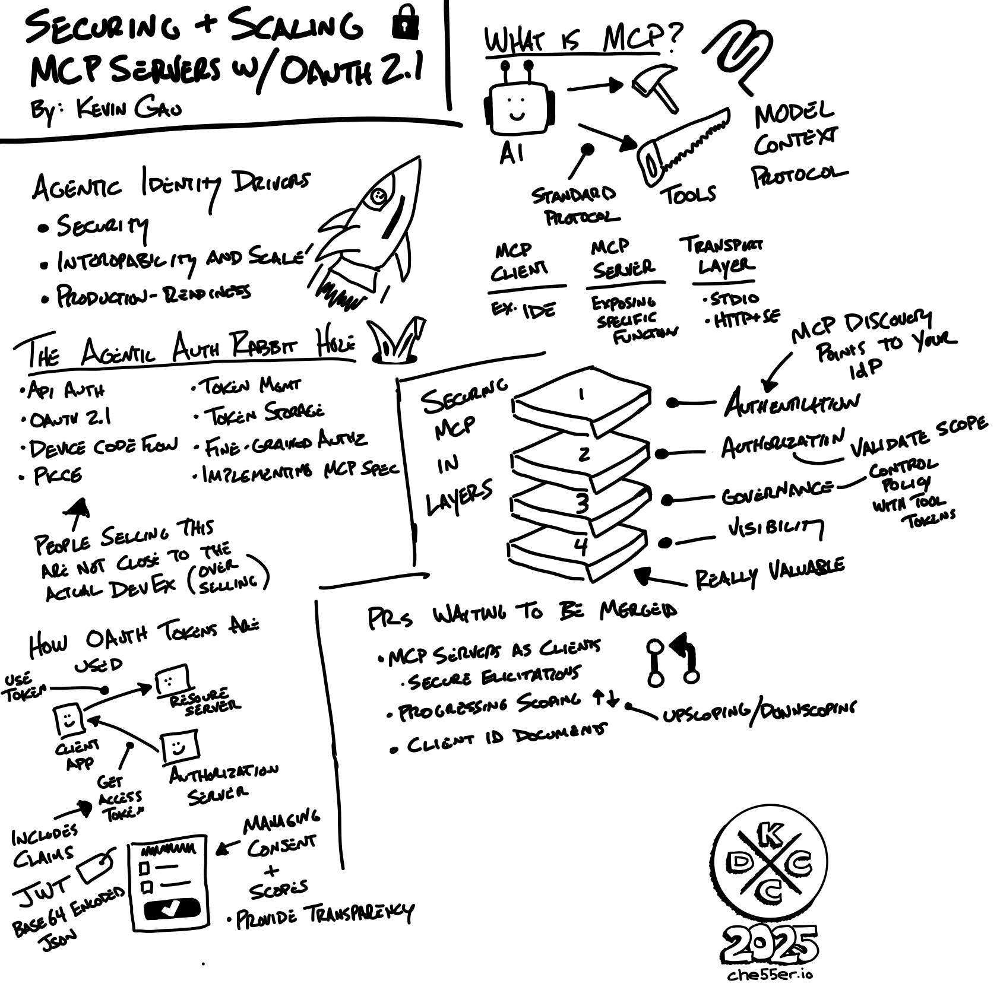
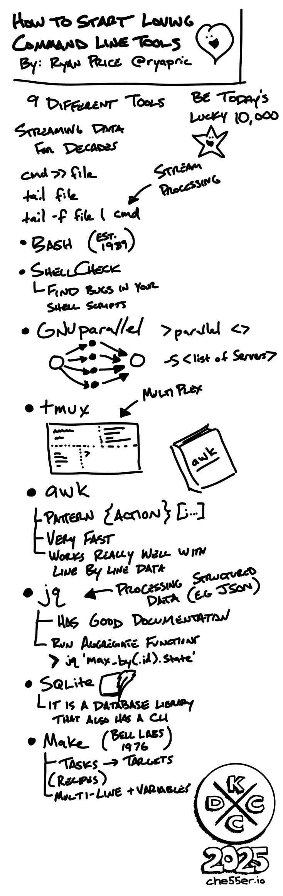
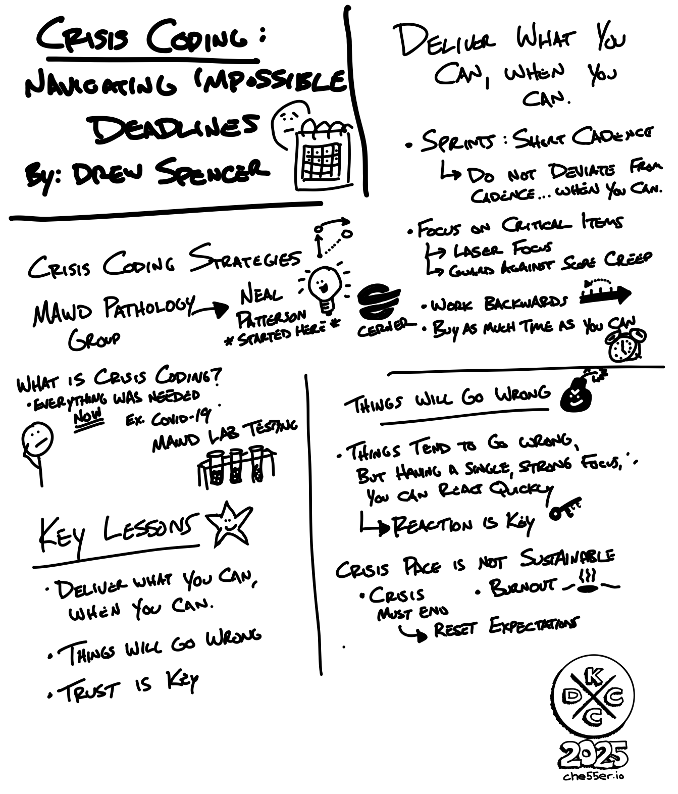
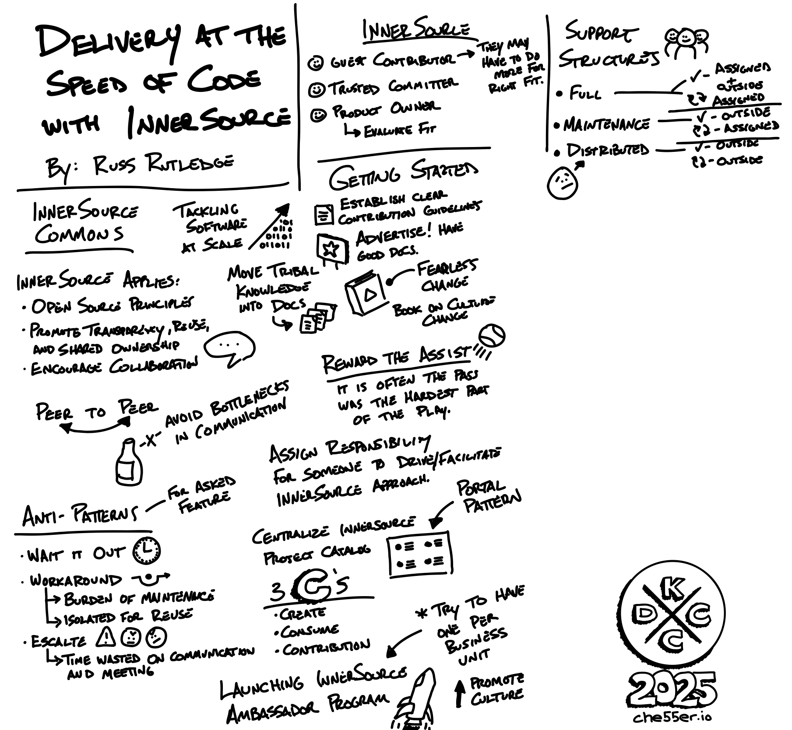
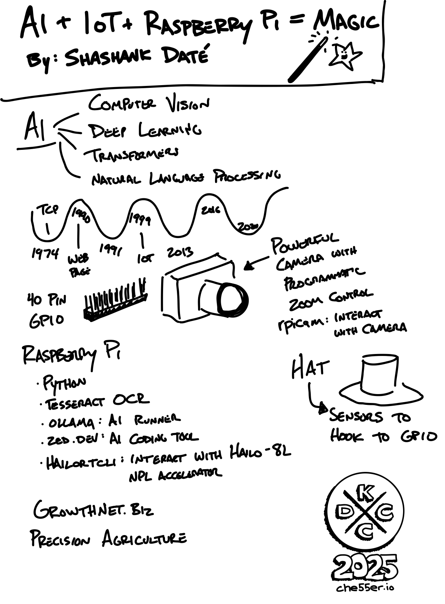
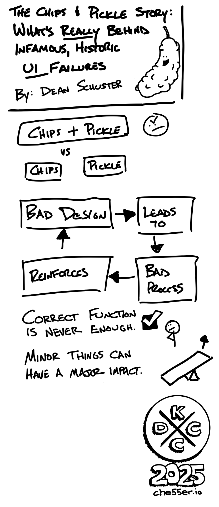

Last week was the legendary [KCDC conference](https://www.kcdc.info/) in Kansas City. This was the first year that [DevOpsDays KC](https://devopsdays.org/events/2025-kansas-city/welcome/) combined with the event. It was a full-day event on Wednesday, which was paired with other workshops, before the sessions on Thursday and Friday. Right when I first arrived at the conference on Wednesday, I saw friends I hadn’t seen in over a year. Conferences like this are such a rich ground for networking. While we all enjoy going to the talks, the unique value in these events is connecting with people. DevOpsDays KC has a concept of open spaces, where there is a dedicated time window that people post discussion topics, and then form tables with different topics that people can join and discuss a topic. You can quickly connect with others on different topics by discussing the problem and sharing ideas on solutions in this space. I enjoyed the networking and time with others as part of DevOpsDays KC, and then other open times (like breakfast and lunch) during the conference to further meet and talk with others. Living and working in Kansas City, this conference enables you to meet and see other professionals in the area, while also connecting with others from all over the world.

Beyond networking, it is always a good time listening to fantastic storytellers. I find that I often like to attend sessions based on the speaker, rather than just based on the subject matter. There were some legendary speakers at this event who are teachers at a masterclass level. Speakers like [Guy Royse](https://guy.dev/) and [Richard Campbell](https://about.me/richard.campbell) were some who stood out in how they can quickly connect complex topics to relatable things to the audience.

When attending talks, I like to take handwritten notes that help highlight the content I am hearing. I use [Adobe Fresco](https://www.adobe.com/products/fresco.html) (a drawing app on my iPad), as this is what I use for other drawings, so it is easy for me to quickly draw and capture notes during the talk. When going through some of these notes, it seems like some of these may be worthy to further share, as they highlighted some notes that I found meaningful. Doing handwritten notes during a talk is a practice that I have found has helped me in retaining information that I found valuable at the time. Rather than just a bullet-list of text, having content that looks like a wall of thoughts with different visuals often helps me recall what things were interesting, or important call-outs as I was hearing them. So, here are some of my notes from talks that I took at the conference...hopefully they are readable for you 😀

## Notes

While these are not all the notes that I took, these were the ones that had the most content, which often signal to me that I was capturing more things from the talk as it was occurring.

### Modern Problems Require Modern Solutions: Finding Your Meme Twin with Embeddings & Vector Databases



  


---

### Understanding Nuclear Power



  


---

### Digging into the Matrix: Practicing Code Archaeology



  


Slides and notes from his presentation [can be found here](https://speakerdeck.com/arthurdoler/digging-into-the-matrix-practicing-code-archaeology).

---

### Don’t Let Your Org Chart Write Bad Code



  


Here is the additional references and content that he shared (check out Conway's original paper on [_How Do Committees Invent?_](http://www.melconway.com/Home/pdf/committees.pdf)): https://guisho.com/c/kcdc25

---

### Securing and Scaling MCP Servers With OAuth 2.1




  


---

### How To Start Loving Command-Line Tools 



  


---

### Crisis Coding: Navigating Impossible Deadlines



  


---

### Delivery at the Speed of Code with InnerSource



  


---

### AI + IoT + Raspberry Pi = Magic



  


---

### The Chips and Pickle Story: What's Really Behind Infamous, Historic UI Failures?



  


## My Talk

While I attended talks, I was also a speaker as part of DevOpsDays KC on Wednesday. My talk was _Mind Hacks for Incident Analysis_. You can find the slides and references [here](/talks/mind-hacks-for-incident-analysis/).

