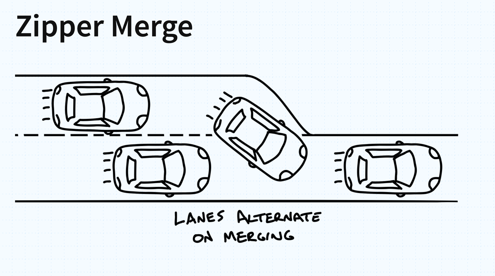

The [Kansas City Developer Conference](https://www.kcdc.info/) was held a little over a week ago, and once again, it was a great opportunity to connect with past colleagues, meet new people, and learn about what is happening across the software development community.

One thing that stood out this year was just how much of the conference focused on AI. It seemed like the vast majority of talks had some connection to AI. Interestingly, though, when I talked with other attendees, I found that many people were particularly interested in the talks that *didn't* focus on AI. Several people commented that it was refreshing to attend a session that wasn't another presentation about AI.

## The Cognitive Cost of AI

In conversations with other engineers, I heard a recurring concern: as engineers rely more heavily on coding agents, they can begin to lose some of their familiarity with the codebase.

People described situations where they increasingly needed an AI agent to answer questions that they previously would have been able to answer themselves. This includes questions about how the system worked or how to quickly diagnose a problem.

There was also a related concern around software quality.

AI can produce code that looks perfectly reasonable in isolation, but that doesn't necessarily mean it is the right code for the system. Engineers can end up adding more and more code that appears valid while gradually moving the repository away from clean design principles or the architectural direction the team intended.

The more we use AI to generate and modify software, the more important it becomes that engineers maintain a strong understanding of the systems they are building. AI can accelerate the production of code. It doesn't automatically improve our understanding of that code, especially when the gain of understanding is associated with effort. This is something that came up in a popular talk: [How My Team Got Worse With AI: The Hidden Tax of Generated Code](#how-my-team-got-worse-with-ai-the-hidden-tax-of-generated-code)

## Why I Still Take Handwritten Notes

Whenever I attend a conference, I try to take notes by hand. If you've seen some of my previous blog posts, you'll know this is something I've done for years. I find that handwritten notes force me to pay attention to what actually stands out.

At conferences, it's common to see people taking pictures of slides. That's certainly useful, and most conference slides will eventually be available somewhere. But there is something different about taking notes yourself.

You simply can't write down everything. Since you can't capture everything, you have to decide what is important enough to write down. That creates an interesting tension between the effort required to capture something and the amount of information you can actually retain. When I'm writing by hand, I tend to capture the concepts that make me stop and think.

Sometimes I'll add a little diagram or doodle to emphasize an idea. Sometimes I'll write down just a few words that will remind me of a much larger discussion. Those small notes often become the things I remember long after the conference is over.

I wasn't able to attend as many sessions this year as I would have liked because of some other work conflicts, but I was still able to capture quite a few notes. I always like sharing them afterward because hopefully if it at least helps one other person, it is worth just sharing.

## Notes


  
  
  
  
  
  


# My Talks

This year I returned as a speaker at KCDC and gave two talks: 

* [Heap Space Nine: Explore your Java Memory with AI](/talks/heap-space-nine/)
* [Why Your Systems Behave Strangely: Systems Thinking for Software Architects](/talks/systems-thinking/)

It was a bigger workload doing the two talks, as the _Heap Space Nine_ talk, was much more development, testing, and exploring options (building an MCP servr that enabled OQL to traverse the heap space with AI). The systems thinking talk was one that I felt was very applicable to a larger audience, so I wanted to make sure I had good examples people could takeaway and apply in their work. Much of the slides in that talk are pretty self-explanatory; however, there was one slide that I added the night before as I thought it would be a good element to include, which is about the _zipper merge_.

# The Zipper Merge

There was one slide in my systems thinking talk that simply showed an illustration of a car traffic zipper merge.

I included it because I thought it would be immediately familiar to almost everyone in the room, especially with all of the road construction that happens during the summer. The interesting thing about the zipper merge is that the concept itself isn't particularly difficult to understand. When two lanes eventually have to become one, vehicles can use both lanes until the merge point and then alternate into the remaining lane.

The goal isn't to create more road capacity. There is still only one lane of roadway after the merge. The goal is to use the available space more effectively and maintain a more consistent flow of traffic rather than having one lane effectively stop while everyone tries to merge early.

But knowing how the system is supposed to work doesn't necessarily mean people will behave that way - and that's where systems thinking comes in. In a zipper merge, each individual driver can have a different goal from the system as a whole.

The individual driver's goal might be:

> "I need to get into that lane as early as possible."

From an individual perspective, moving over early can feel like the safest strategy. If other drivers are merging early, there can be a strong incentive to do the same. However, if everyone follows that individual strategy, the overall system can perform worse.

The system's goal is different: maintain the highest possible flow through the bottleneck. That's a goal-alignment problem. The interesting part is that this isn't necessarily a problem of intelligence or information. People generally understand what a zipper merge is. Many people have seen the signs explaining how it works. Transportation agencies have even tried to improve the information flows around these situations by using signs and other communication to explain that drivers should use both lanes and merge at the designated point.

But changing information isn't necessarily enough when the incentives and goals of individuals remain different from the goal of the overall system. Changing goals is one of the leverage points in a system, that can have the larger impact - but also takes some of the most effort to achieve.

Something that seems incredibly simple can actually expose a much deeper systems problem. The difficulty isn't understanding the concept. The difficulty is getting individual behavior aligned with the goal of the overall system. And that's something we see constantly in software systems as well. Organizations can create incentives that encourage behaviors that make sense for an individual group but work against the larger system. Later in the talk we highlight the different leverage points, and then hit on how changing goals in the system can be one of th hardest things to change (like with the zipper merge).

# Conclusion

Overall, it was another great year at the Kansas City Developer Conference. I hope some of these notes may help you, and I look forward to KCDC in 2027!
