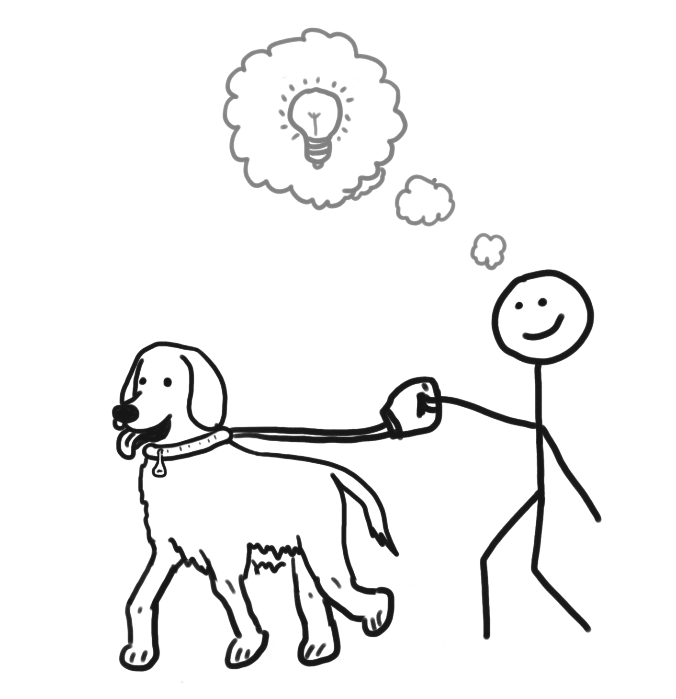

As I talk with other engineers, I have found a common question that typically arises on "How do you make time to stay current on technology?" Other flavors of the same question are, "What podcasts do you listen to?", or "How do you find technical articles that are good to read?" While I seek these same things, I find that many times people do not often talk about how can they optimize how their brain can process the things they have been learning. Meaning, not where can I find yet more information, but how can I optimally use this information in my life. In this short post, I will share something that has worked for me in my life, which I didn't intentionally seek, but found that it produced an optimal setting for me to reach a creative thinking period in my mind.

### What is _Creative Thinking_?

I'm labeling _creative thinking_ as a period when your mind is able to deeply process a topic, but also look at different ways of applying what you have previously learned. Much of what I was finding in my life, was taking what I have learned, and quickly applying it to problems or choices. While this is an important skill, these solutions aren't something I would categorize as very creative. While one could view these solutions as having creativity, they were closely aligned to how problems were solved in the past. Therefore, I view creative thinking as a means of coming up with new ideas that take what I have learned from the past, but look at the problem differently to come up with hopefully a better and different solution.

Some view this as [lateral thinking](https://en.wikipedia.org/wiki/Lateral_thinking), where you are trying to seek an alternative means of viewing a problem. In addition to this type of thinking, I found a need of allowing your mind to wander to increase your level of creativity. While this doesn't sound like an efficient use of your brain, many times the way you view the world or a problem becomes more fixed the longer you focus on it. By finding ways to allow your mind to wander, by prepping your brain with the problem set that you want to think about, you actually can find ways of getting unstuck.

Early in my software engineering career, I was given the advice of when you get stuck on a problem, to get up an go get a Coke from the vending machine, and then come back to the problem. This simple break from that mode of thinking, allowed you to re-approach the problem which can possibly help you get out of being stuck. While I don't find this simple trick really engaging in creative thinking, it does hit some of the same simple points of getting unstuck on how you are viewing a problem. To achieve having your brain re-engaged, it actually required you to briefly disengage.

Therefore, I found creative thinking a combination of lateral thinking with an inviting environment to allow your brain to wander. This combination helps you both view problems differently, but not force your mind to solve some problem with the typical conditional paths in your brain. While I'm in no way a scientist that studies the brain, I do believe these to be effective ingredients to reach a creative thinking period.

### The Large Dog Method

Throughout my life, I have loved having dogs as part of our family. There are many great benefits that dogs provide for humans, but for this article, I won't really get into all those details. I will simply explain how our furry family member helped find an important time in my day, which was a creative thinking time.

Our family has a large dog, which the size of the dog I think matters for this topic. With a large dog, they require more things, more food, more furniture or toys to destroy, and more time to walk. In order to keep our dog happy, we found we needed to walk him daily. These walks generally were around 3 miles, and it would take us typically 35 - 40 minutes to walk. Sometimes we found ourselves also extending this walk, depending on our available time. However, one thing that didn't really vary, was how often we needed to walk him (daily). It wasn't until later in his life and as we had children, we found we weren't walking him as much. At this point, I found that he brought something into my life that I didn't realize I was getting till it wasn't occurring as much. This gift was a routine schedule of longer walks that became my creative thinking time.

What I'm labeling as _The Large Dog Method_ is an approach to routinely achieve a period of creative thinking in a busy life. It is composed of the following supporting parts:

* **Routine**: By having a large dog, he demands to be walked every day to be happy. If he is not happy, his size is threatening enough through barking or destroying your property to incentivize you to honor his request. Having a friend to keep you accountable on doing this exercise routinely, helps you stay consistent and builds an established pattern in your schedule.
* **Walking invites wandering**: Research indicates that the act of [walking is an optimal exercise of reaching a creative thinking state](https://news.stanford.edu/2014/04/24/walking-vs-sitting-042414/). By allowing your mind to wander, it allows you think and look at things differently. To reach a wandering state, you generally need a longer isolated set of time. By having a large dog, you engage in walking for a longer period, allowing you enough time to reach this state of thinking.
* **Lack of conversation**: When I was walking our dog, I many times enjoyed catching up on my podcasts. However, when I simply went without listening to anything, I just walked and thought. Our dog didn't demand any conversation, and he was completely happy as a result of it. Whenever you would walk with anyone else, you generally always have a conversation, but you wouldn't be doing any deep thinking. Having a setting that doesn't compel you to do other things, like talking, helps minimize other common forms of distraction from reaching a deeper state of thinking.
* **Avoiding costly distractions**: When walking your dog, you will get distractions, but these distractions don't generally extend into too many other things. For example, you might have another dog come up that wants to say hello, or you have be aware of traffic when crossing the street. These distractions are short, and do not invite you to get detracted from this longer prolong state of thinking. At home, if I'm reading something online or hearing something on the TV, those distractions have many invitations to read yet another article, tweet, YouTube video, or whatever else that doesn't really support this desirable state of thinking.

### So, I have to get a dog?

I wanted to share this thought of _The Large Dog Method_, only because I think we all need to reflect on where are spending our time, and seek for these moments of deep and creative thinking. I never planned on getting a dog so I could get more time to think about problems. However, I realized that our dog gave me this gift, and it became my way of ensuring I had time in my schedule for this type of thinking.

In a world with an endless amount of distractions and digesting ideas that are as short as a tweet, I have found it very valuable to ensure you have time to intentionally disconnect and think. Even having enough time to think about thinking. Seek this in your life, and you will find that your brain can produce great results when given the opportunity. For me, having a large dog created these moments, so intentionally seek what is the "large dog" in your life, or if you don't have it, create it.
