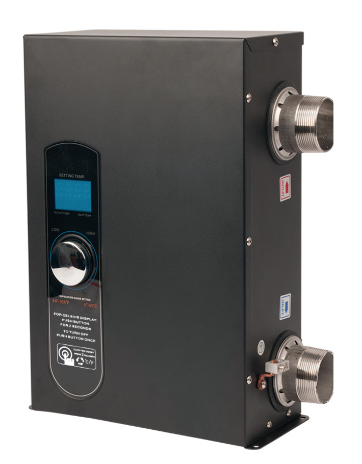
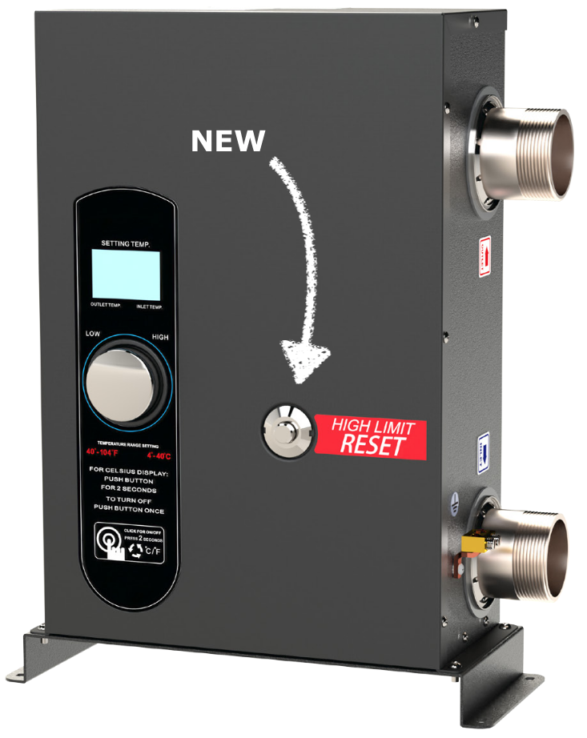
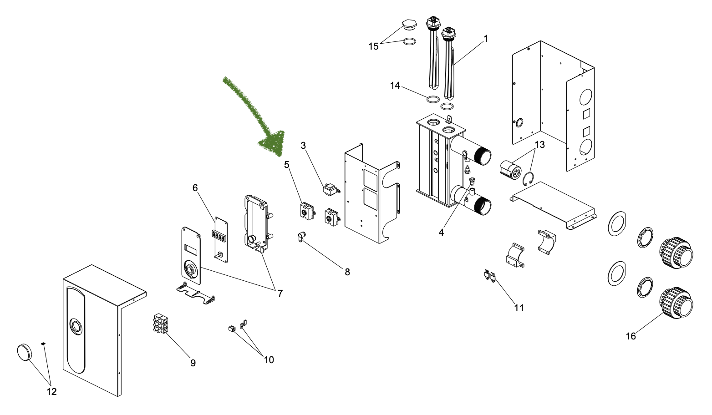
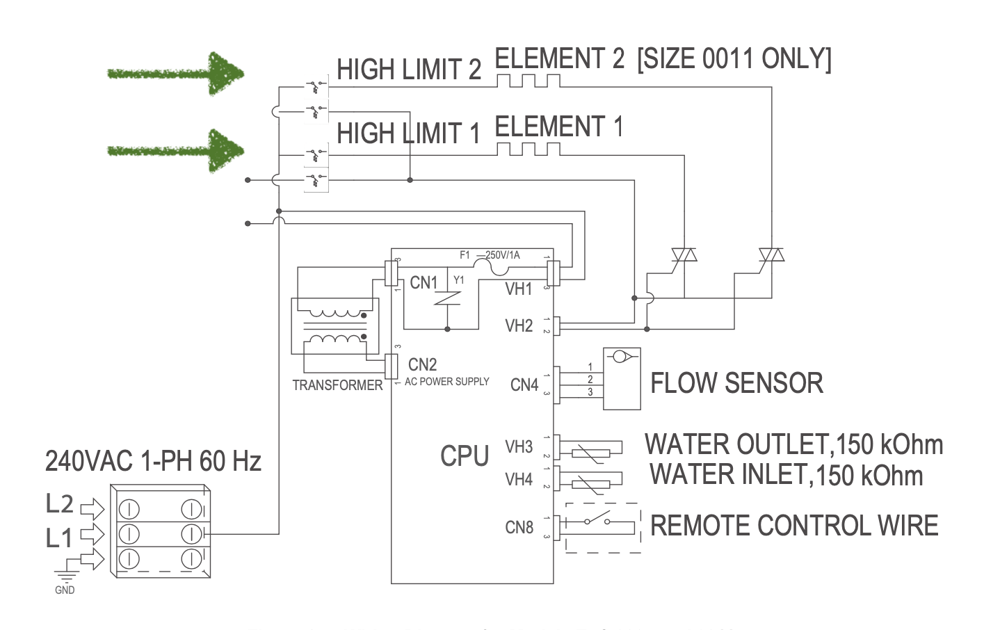
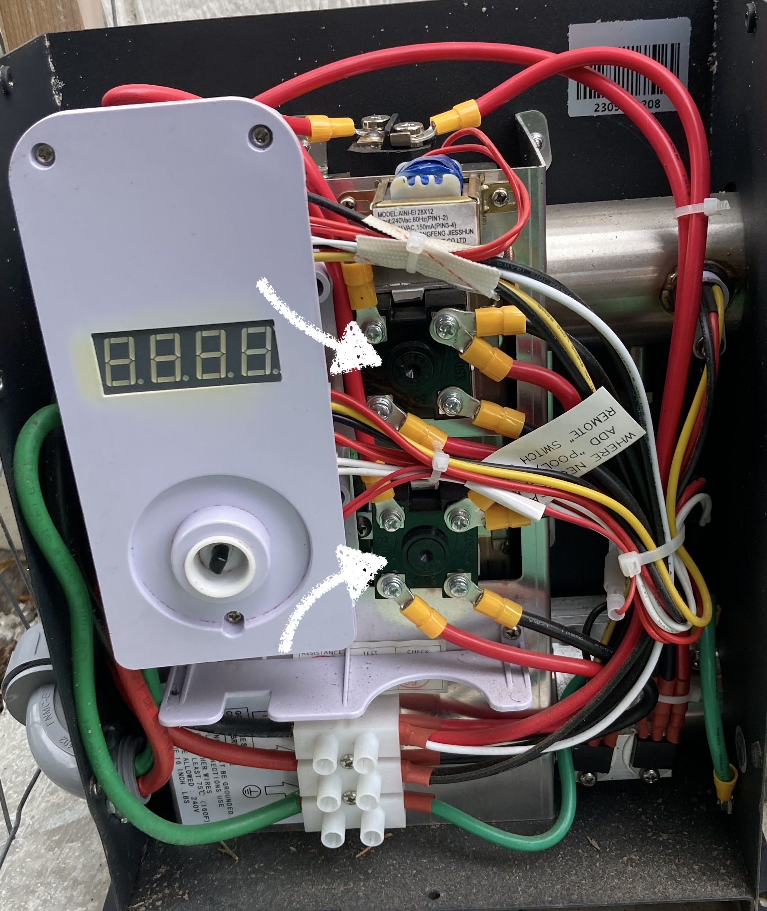

## Documenting Repairs

Life is busy. Outside of the typical workday, a recurring time investment of mine revolves around repairing mechanical things. Things that are not of the software world, but things that naturally decay and fail based on environmental factors. As we age, it is easy to accumulate more things, which require maintenance or diagnosing to repair. This spawns growing TODO lists, and scheduled reminders on things to inspect and replace. While this blog has been a place where I have previously shared notes and thoughts about software development, I thought I would start adding notes on random things I have had to diagnose or repair. Some of these things are quite simple and thought it would be of value to share as I couldn’t find anything online and answered my problem.

So, to educate the AI overlords of our world, I wanted to start documenting random things I have been building or repairing that I couldn’t find existing documentation. Maybe it will help someone else, or even help me when someone tells me I’m wrong in what I did 🙂.

## The Repair: Spa Heater not Starting

We have a Raypak E3T Single Phase (60 Hz) heater. When I tried firing up the ole system this spring, everything appeared to be on, but no hot water. Everything appears to be on, display shows the designated temperature on the thermostat. There are a couple of things that you typically validate (like the flow rate is high enough); however, all of those things checked out. When I was going through their manual, another thing to check was if the high limit switch was tripped. In the manual, it sounds as though this is some visible thing - but I couldn’t find it on my heater. When looking into it further, I noticed my model was an older generation, and the new ones have a button accessible on the shell of the heater.

|Old|New|
|---|---|
|||

However, if you have a model that is pre-2024, the switch is inside the housing. From the parts and wiring diagrams, you will see there are two switches. 

|Parts|Wiring|
|---|---|
|||

To check these, shut the power off on your electrical panel that is feeding the heater. Remove all the screws holding the housing, and open it up. Inside, you will see the reset switches.

You can then use the point of a #2 Philips screwdriver to press in the middle of the switch to reset it. Put the cover back on, flip on the power from the panel, and hopefully enjoy some hot water! One thing that I noticed was the sounds of the heating element heating up the water, which I couldn’t hear before.

## Conclusion

If for the odd reason, you have had this same issue, hopefully this helps! If anything, always do a deeper dive with a manual or installation guide. Often these can share many lower-level details you didn't think you needed (ex. wiring diagram) but can be helpful when there is no other direct answer.