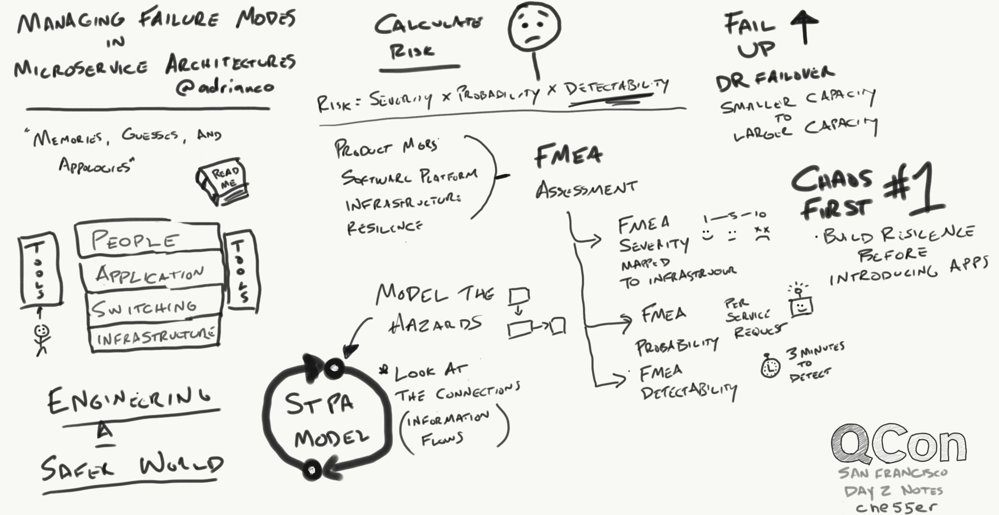
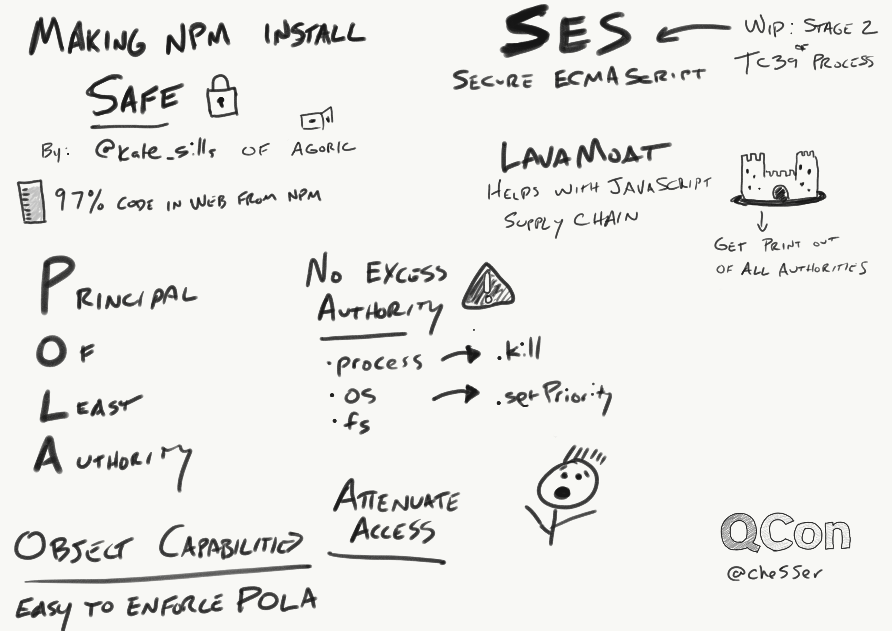
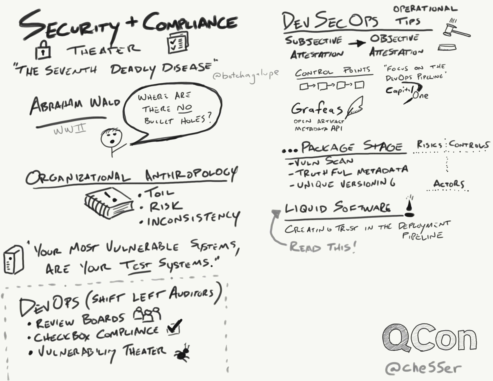
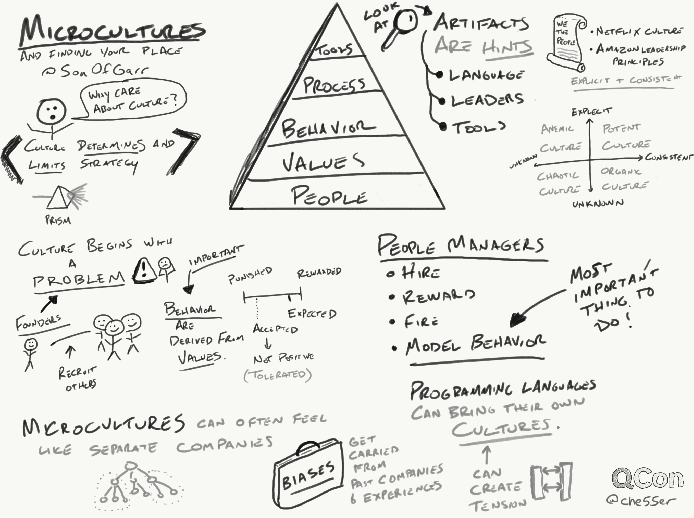
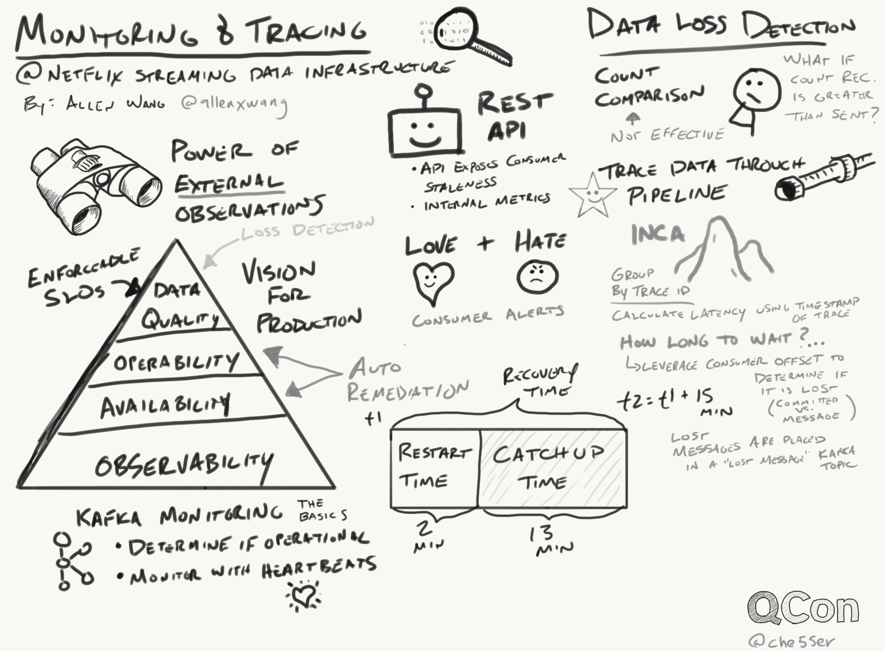
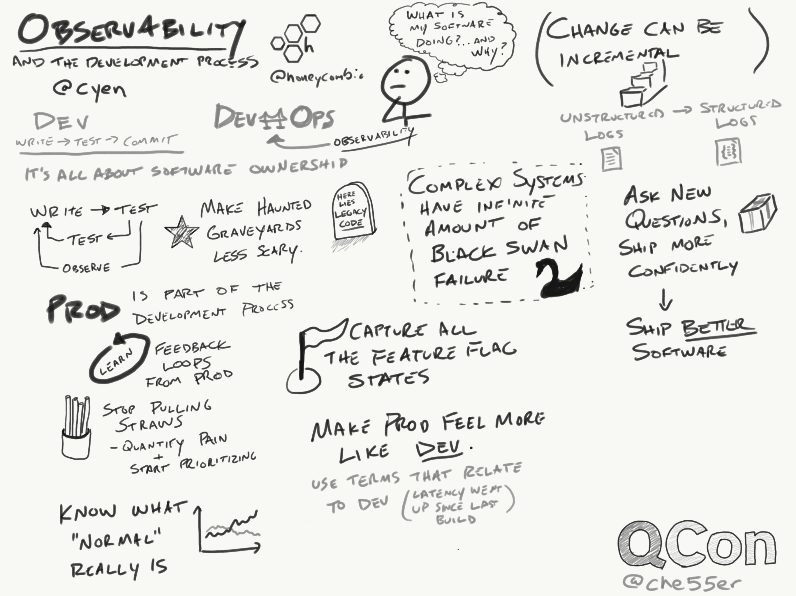
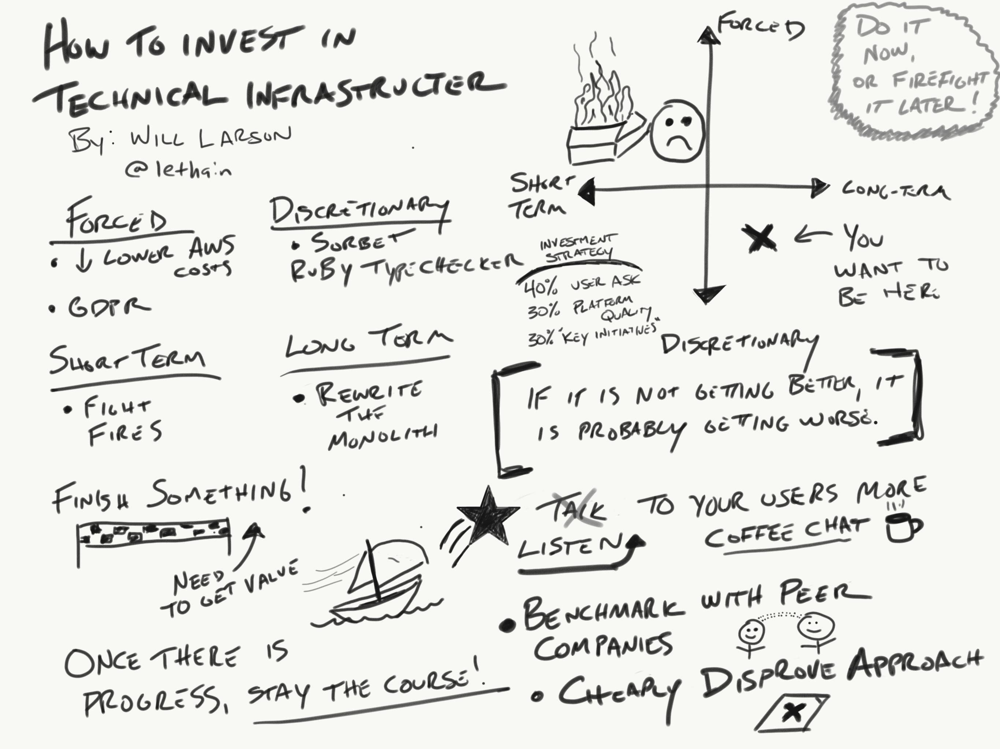
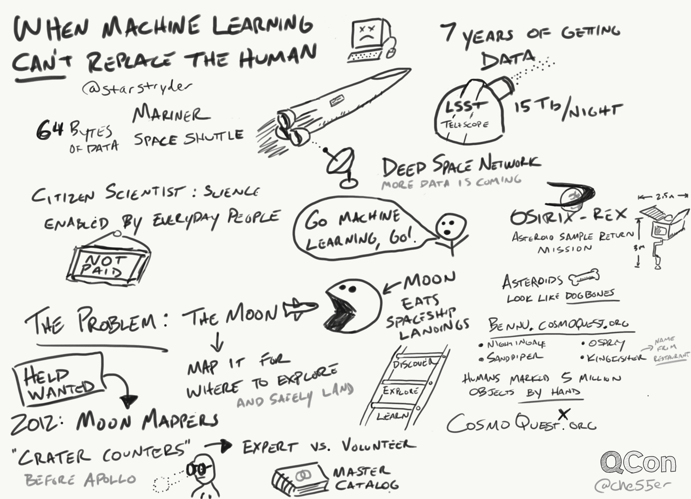
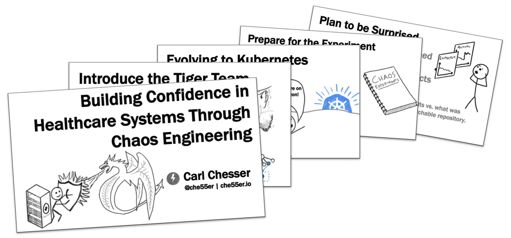
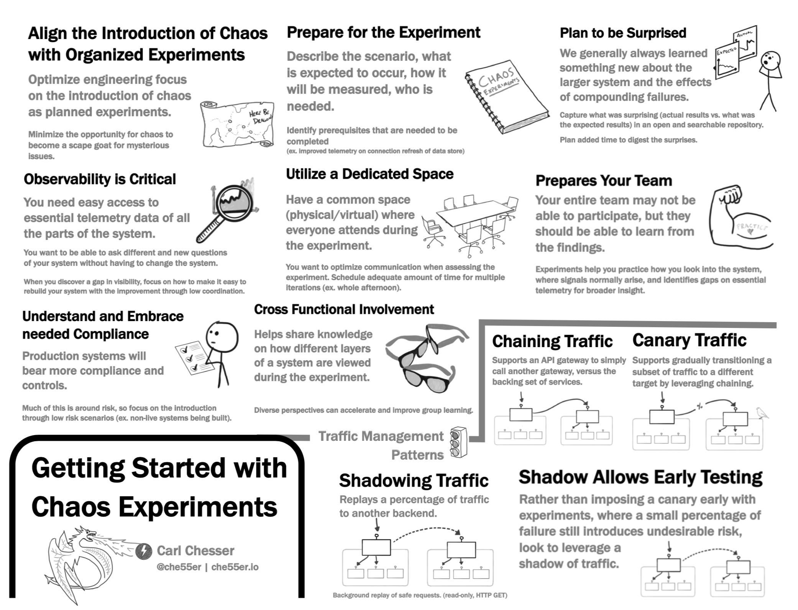

This was my first time attending QCon, and I was really impressed with the quality of the conference. I have been a long time consumer of content on [InfoQ](https://www.infoq.com/), so it was great to be there in person and meet more practitioners that are working on interesting problems. This blog post will be a brief recap of my experience and the notes I took from the talks I attended.

## Overview

QCon is a conference which organizes its talks into specific tracks. Track hosts that have been identified as experts in that domain, then do the work of identifying speakers to talk in these tracks. This approach makes it very clean on how they have direct selection on the talks to ensure they fulfill the targeted track and the speakers are known for being good at public speaking. As a result, majority of the talks are well prepared and are conveyed in an effective way. The conference was held all within a single location, Hyatt Regency in San Francisco, which made the logistics for attendees quite convenient. It was easy to get to and from talks, allowing you more time to strike conversations with others, and lowering the stress of having to determine where do I need to go next.

I was attending this conference as a speaker, so I had some added stress of preparing for my talk beforehand, but was really honored to have the opportunity to attend and speak. QCon does a fantastic job of preparing you for the talk, with resources on how to give a good talk and opportunities for others to review the talk for early feedback. While I was stressed on making sure I had prepared enough for my talk (my talk was on the last day of the conference), I was able to focus mostly on the other talks as I had finished my content earlier and had a chance to practice it to ensure it was within the targeted time.

While at the conference, I had the opportunity to connect and talk with many other engineers and practitioners. By being in San Francisco, I was able to reconnect with a couple former colleagues which made it a really valuable time. I then was able to connect with other speakers which I found extremely valuable. For the last few months I have been having to dive deeper into container security, building minimal OS images, and scanning these for security related vulnerabilities. At a social dinner for speakers of the conference, I was able to connect with [Nisha Kumar](https://github.com/nishakm), and was able to get a lot of valuable insight from her work on [tern](https://github.com/vmware/tern) and validate some of the container image building challenges we have been experiencing. When talking with others at lunch and breaks, I was always interested to find where others were from and what they were working on. Several times I found people some tie back to the Kansas City area (where I'm from) or work in the related industry (healthcare). By having my talk announced before the conference, I also had some other planned meetings with companies and start-ups to learn more about what they were trying to solve, and how it related to challenges we were facing at our company. Having these scheduled meetings were valuable to have additional conversations that I wouldn't probably normally engage if I didn't plan beforehand.

## Notes

For me, I have found that I am able to retain and remember more content when I take notes by hand. This includes pairing notes with simple illustrations to help capture or highlight a point. Here are my notes from the conference for talks that I attended, that resulted in enough notes that I thought it was worth sharing.

_Note: When doing other diagrams of systems, I have found where I like to include simple facial illustrations (happy, sad, confused faces) on pictures of infrastructure to quickly convey emotional state about that thing. It makes it very easy to express to others about these feelings (universal symbols that are quickly recognizable). This style might show up in some of these notes where I tried to convey if something is good, bad, confused, scared..._

### Managing Failure Modes in Microservices Architecture

Talk by: Adrian Cockcroft [@adrianco](https://twitter.com/adrianco)

### Making npm Install Safe

Talk by: Kate Sills [@kate_sills](https://twitter.com/kate_sills)

### Incident Management in the Age of DevOps and SRE

Talk by: Damon Edwards [@damonedwards](https://twitter.com/damonedwards)



### Security and Compliance Theater

Talk by: John Willis [@botchagalupe](https://twitter.com/botchagalupe)

### Microcultures and Finding your Place

Talk by: Mike McGarr [@SonOfGarr](https://twitter.com/SonOfGarr)

### Monitoring & Tracing at Netflix Streaming Data Infrastructure

Talk by: Allen Wang [@allenxwang](https://twitter.com/allenxwang)

### Observability and the Development Process: Not Just for Ops Anymore

Talk by: Christine Yen [@cyen](https://twitter.com/cyen)

### How to Invest in Technical Infrastructure

Talk by: Will Larson [@lethain](https://twitter.com/lethain)

### When Machine Leaning Can't Replace the Human

Talk by: Pamela Gay [@starstryder](https://twitter.com/starstryder)

## My Talk

The talk I shared was "Building Confidence in Healthcare Systems with Chaos Engineering." This talk focused on the technology challenges we were facing, how the team introduced gameday exercises (which were chaos experiments) to evaluate the system designs, and the lessons learned along the way.

Slides can be found [here](/slides/qcon-sf-2019-confidence-building-w-chaos-engineering.pdf).

Printout Guide can be found [here](/guides/getting-started-w-chaos-exp-guide.pdf).

## Wrap-up

It was a great experience being at QCon. I really enjoyed getting to meet and talk with other engineers and the talks within this conference were strong. I hope it works out to attend future QCon conferences, and I'm really thankful for the opportunity for speaking at this event.