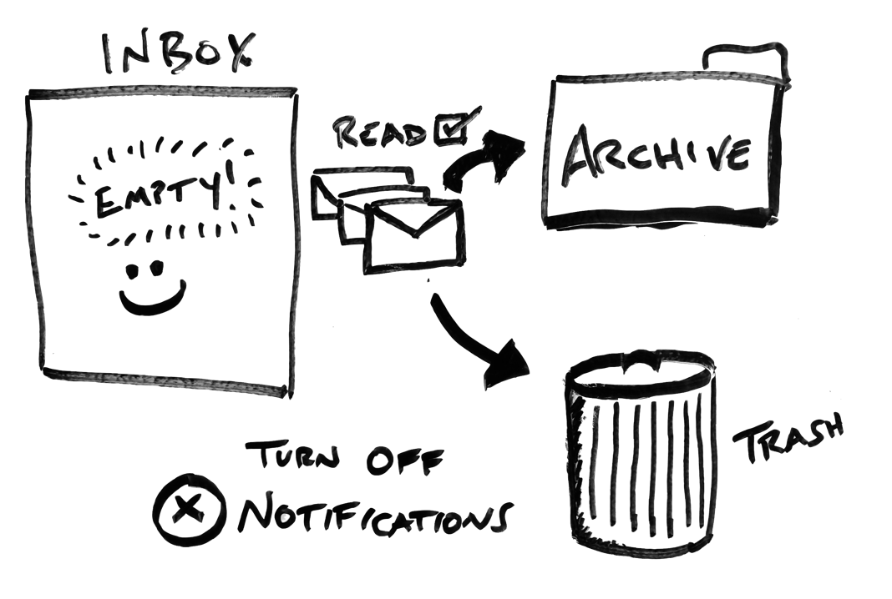

As I have explored ways to be more productive, I generally find that everyone has a way in which they process their emails. Given that email is such a common element of communication that everyone deals with, and it has been around for a long time, there are generally several different ways of optimizing this continuous amount of content. Here is my process of how I manage my email at work, which I realize is quite simple. Perhaps you can share with me how you do it better, and I can further improve my approach:

# Turn off notifications for new emails

I realize many people rely on knowing when they get a new email, to act on it. I have found this to actually be very unproductive for a large set of tasks for knowledge workers. Meaning, you generally have tasks that require deep thought or prolong concentration. To do these tasks effectively, you don't want things invading your concentration, especially when you are equipping any person with the ability of doing it by just including your name on the "TO:" line of an email. While I have learned how others have optimized their alerts with rules based on the sender, I find it better to change the way I consume email.

I don't alert when I get email, and I chose to read my email with intentional blocks of time. Have you ever had that moment when you feel really productive, then realized your email client wasn't running? Well, you can achieve this as well, but just control when you engage in responding or working through the email in certain bursts of your day.

# Clear inbox based on "Read" indicator

My goal is to keep my inbox empty when I do a burst to work through what is sent to me. To manage what email I have processed, I simply just use the "Read" indicator on the email. I realize this is a pretty basic means of indicating if I have addressed an email, but I simply mark an email as "Unread" if I read it, and I'm not going to be able to respond to it within my burst. Therefore, it will be tagged to stay in my inbox for subsequent rules which I executed.

I then have a series of rules that I trigger at the end of the burst to organize the emails into either my archive (to be referenced later) or in the trash. For example, I get a decent amount of notifications (ex. GitHub/JIRA notifications) which I do  prefer to read, but I don't plan to ever refer to them in the future, so I simply delete them if they are marked as read. Other emails that are read, I simply archive them out of my inbox. This allows me to capture the original conversation threads if I need to recall them later, but keeps it out of the inbox.

# Focus on minimizing what you get in your inbox

I found that I didn't like having a lot of rules organizing everything into other folders that required my routine attention. Yes, I do have still rules that organize general updates (like Google news alerts), that I will occasionally look at, and use rules to organize them from not reaching my primary inbox folder. However, I many times ended up just having more folders of content I wasn't actually getting to, and ultimately not really consuming. By keeping the system easy on what comes into your inbox, you force yourself to be more mindful of what type of content you are subscribing into your inbox.

# Have a moment when your inbox is empty

There is a value to having your primary inbox cleared. For a long time of my career, I didn't value this, but often found that I would occasionally miss responding to an email or increase the daily tax on my mind on what I needed to respond to (check out [Getting Things Done by David Allen](https://gettingthingsdone.com/) for more on having a reliable way of inventorying incoming tasks). I have been using this process for several months, and it has really lowered how much context switching I was having with email, and being more productive when I focused on addressing email.

_This is the first part of the [Email Trilogy](/blog-series#email-trilogy) blog series_.