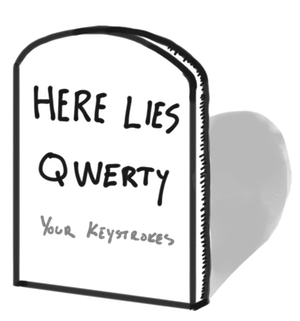

I previously posted a short set of notes of how I apply my [simple process of digesting emails](/post/simple-email-process/). However, I think there are some other important rules of when to produce email. In this short post, I will share a couple things to keep in mind before you send an email.

# Email is where your keystrokes go to die

Several years back, I watched this talk by Scott Hanselman on [Scaling Yourself](https://www.youtube.com/watch?v=FS1mnISoG7U), which touches on several topics on how to improve your productivity. Of these topics, one of the phrases that stuck with me was:

> Email is where your keystrokes go to die.

This quote is a reference to how email consumes a limited resource: your keystrokes. Knowing we all have a limited amount of time on this planet, we also have a limited amount of keystrokes before we die. When you are emailed a question, it is inviting you to respond back with an answer to their question. If you are feeling generous, you may send them a very well documented answer with code examples and references, which is a large gift of keystrokes. The primary problem with this approach, is that you just gifted a limited audience (only those on the TO or CC line) a large set of your keystrokes, and you don't even know if they will read it.

Scott gives the advice that you should never send a long email. If you do, you should write it in a blog, wiki, knowledge base, or issue tracking system, and then email them the link. This way, your gift of keystrokes can be expanded to a much larger audience. Furthermore, your gift of keystrokes can live on beyond your time on this planet (and are not trapped in someone's inbox folder).

Don't waste your keystrokes in email, allow them to live on in publicly accessible and searchable locations.

# Don't Train People to Respond in the After Hours

Something I have struggled with in my own career, is reading and responding to work related emails outside of _normal business hours_. Meaning, when getting an email from someone about an issue at work (that does not require an immediate response), and then responding that same evening with the follow-up. Once you send an email, it *invites a response*. Furthermore, it invites an unhealthy behavior of leveraging people's willingness to help, but doing it when it is not necessary. I believe most people are interested in helping each other, at least those they closely work with. By sending the email in the late hours, they may also see it and feel compelled to respond, even though it isn't necessary to be done immediately.

You can slightly change this behavior, by not indicating to your team that it is healthy to be working late. To do this, you can leverage what several email services offer, which is scheduling when the email is sent to your recipients. This allows you to send your email when it works for you (when the question is your head), but doesn't deliver it to your recipients until a later, _healthier_ period (ex. the following morning @ 8 AM). Examples of this are [Outlook's _Send Later_](https://support.office.com/en-us/article/delay-or-schedule-the-delivery-of-email-messages-in-outlook-for-mac-a02097de-76c2-4895-9557-0818ef229024) or using [Boomerang with Gmail](https://www.boomeranggmail.com/).

While, I believe it is important to have your own approach of how you digest email, don't assume you know how other people digest their emails. Avoid sending emails in the after hours that invite a response when it simply isn't urgent. If it can wait till the morning, allow it to be delivered with that same timeline.

_This is the second part of the [Email Trilogy](/blog-series#email-trilogy) blog series_.