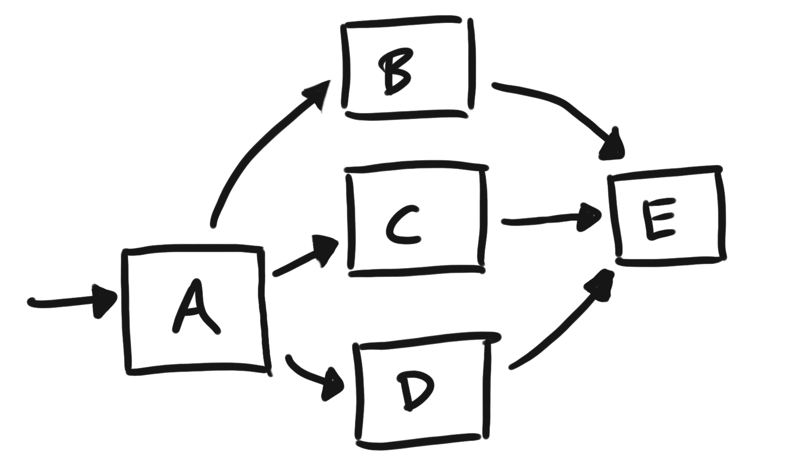
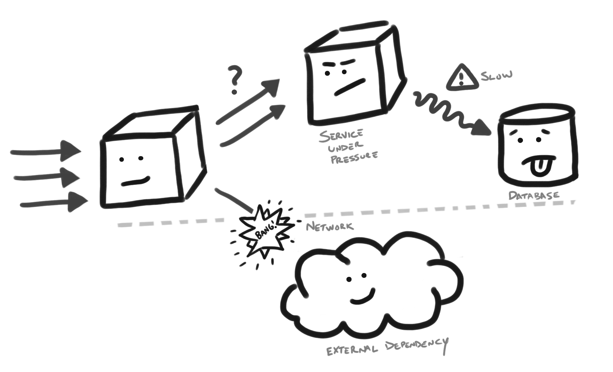

Diagraming is a powerful way of communicating ideas to others. In this past year, I have found how much I have missed the time of just working with a group and using a whiteboard to convey our ideas. In the past few months, I have referenced past diagrams or shared recent examples which included a few properties in the diagram that I believe are useful. In this short blog post, I will share some thoughts on the power of diagrams which use simple universal symbols.

## Start with Simple Box and Arrow

When it comes to diagramming, you can get pretty elaborate. Especially as digital tooling advances and exposes multiple options in building these artful sophistications. I strongly recommend in starting with simple to the box and arrow diagrams. Avoid trying to convey through additional types of icons when initially communicating your ideas. Architecture of our systems is illustrated through their relationships of entities, which can be achieved through these two simple elements (boxes and arrows). The simplicity and versatility of the box and arrow diagram is something I think we occasionally associate as a weaker form of communication. It looks so basic, it feels like it doesn't bring any significant value over a verbal description. However, I would argue that an image, as basic as it may be, becomes a central point when describing something. By leading with this simple illustration, you aren't over investing in some time intensive diagram, as you can do this with just pen and paper and take a photo of it. No fancy software required!

Box and arrows are a simple, universal way of expressing a system and brings a visual aide at a low cost when initially discussing an idea.

_Note: Without even knowing what these boxes represent, you can see flow and how E is a critical dependency. Try describing this in written or verbal form to someone else, and see how much more effort it takes to just convey this elementary set of relationships. You will find that the audience tries to draw this same picture in their head to render what is being described._

## Adding in Emotional Indicators of State

As you look to broaden what type of information is delivered in your illustrations, you may find that your box and arrows no longer suffice on their own. This is where additional symbols can be of assistance. When seeking to add different symbols, consider using _universal_ symbols. By universal, I mean they are well-known and do not vary in their interpretation. For example, a smile can indicate something that is good and happy or a fire can indicate destruction. Universal symbols are well within reach to use, but I find we often don't leverage them in our own illustrations.

In a past talk, I shared how I have found it helpful in using emotional indicators in some of my diagrams as it can quickly illustrate things which are good or bad in the system. It also reduces how much text is needed to convey that message. Furthermore, I have found it helpful in controlling areas of focus. If you illustrate some scary piece of infrastructure, as something that looks scary or mean, your eyes gravitate to that in the illustration, ensuring you keep the audience focus on this area of concern. 

You can check out the talk here, which jumps right to this topic of _Visualize your Idea_:


One of the main reasons that I like the usage of emotional indicators, is that they are simple and very accessible. If you can draw a box and arrow, you can probably draw a happy or sad face. These elements, use in unison, can communicate more than you think. I have had people complement these rudimentary pictures, which highlighted how they were also more engaged in the diagram.

## Novelty is Powerful

As I have shared in [an earlier post](), I think your own hand drawings can bring a stronger attraction than you think. They are a unique illustration, that _feels human_ and can attract people quickly to a picture that you can navigate through your description. Don't underestimate this power in using your own illustrations. They are a quick way of bringing a visual that can also harness more attention easily from its uniqueness through your personal illustration.

## Conclusion

Practice sharing a simple illustration whenever conveying a new idea. Start with a low cost illustration, like a box and arrow diagram, that can convey more to your audience and further serve as a reference point in a discussion. Consider the use of universal indicators (like emotional symbols) which do not require extensive textual descriptions, as the it can be understood from a broader range of backgrounds. These unique elements can attract attention to areas, which can naturally guide your audience to areas of interest. 

We are visual creatures, so be visual in how you communicate and share your diagrams!