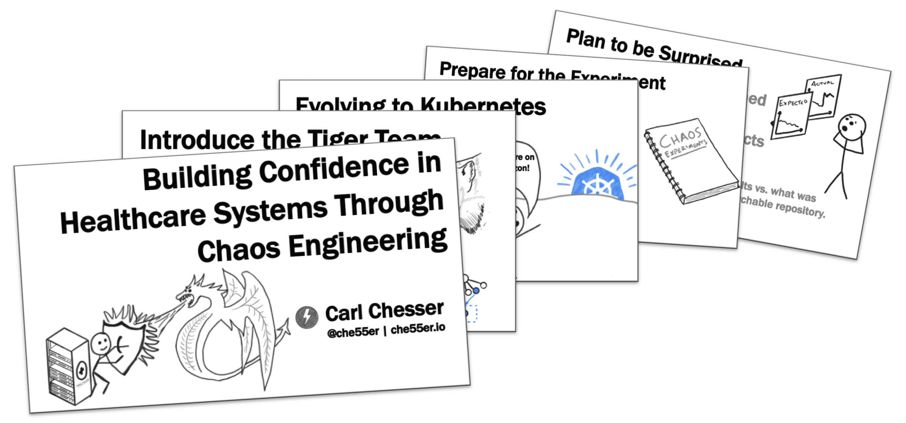

* [QCon San Francisco 2019 recording](https://www.infoq.com/presentations/cerner-resiliency)
* [Slides](/slides/qcon-sf-2019-confidence-building-w-chaos-engineering.pdf)
* [Get the 8.5 x 11" PDF hand-out](/guides/getting-started-w-chaos-exp-guide.pdf)
* [QCon SF 2019 Recap](/post/qcon-sf-2019-recap): Blog post that summarized my experience at the conference and all of my notes.

_This guide includes a second page, to convert the guide into a paper airplane._
