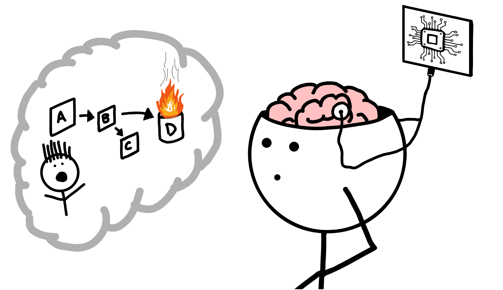

## Abstract

We are great at quickly gravitating to problems. Especially, with our deep understanding of the systems we own and operate. When things go wrong, great teams are quick to adapt, mitigate, and identify what we should do better in the future. However, it is easy for us to limit our minds based on our perspective of the system or how we have always done it.

In this talk, we will explore how we can improve our ways of learning through failure. This will cover methods to help explore ideas that often get missed when we focus on the sharp ends of our systems. We will cover cognitive science and time-tested problem-solving approaches to improve how to explore a problem space. This will include communication methods to improve your collaboration with others while exploring failure and seeking new ways of solving problems.

Through this talk, I will share my lessons learned over the years of doing incident analysis at Oracle Health and include key literature that others have shared with me to improve my understanding. You will then leave with take-aways that can improve your incident analysis or other problems you are looking to solve.

## Content

* [Slides](/slides/mind-hacks-for-incident-analysis.pdf)

## References

* [Deming, W. Edwards. The New Economics for Industry, Government, Education (2000)](https://www.goodreads.com/book/show/638739.The_New_Economics_for_Industry_Government_Education)
* [Meadows, Donella H. Thinking in Systems: A Primer (2008)](https://www.goodreads.com/book/show/3828902-thinking-in-systems). See also, [Leverage Points: Places to Intervene in a System](https://donellameadows.org/wp-content/userfiles/Leverage_Points.pdf)
* [Dekker, Sidney. Drift into Failure (2011).](https://www.goodreads.com/book/show/10258783-drift-into-failure)
* [Dekker, Sidney. The Field Guide to Understanding "Human Error", 3rd Edition (2014)](https://www.goodreads.com/book/show/152014656-the-field-guide-to-understanding-human-error-3rd-edition-by-sidney-dek)
* [Allspaw, John. “The Infinite Hows.” Blog article, 2014](https://www.oreilly.com/radar/the-infinite-hows/)
* [Montalion, Diana. Learning Systems Thinking (2024)](https://www.goodreads.com/book/show/205977642-learning-systems-thinking)

## Related Posts




