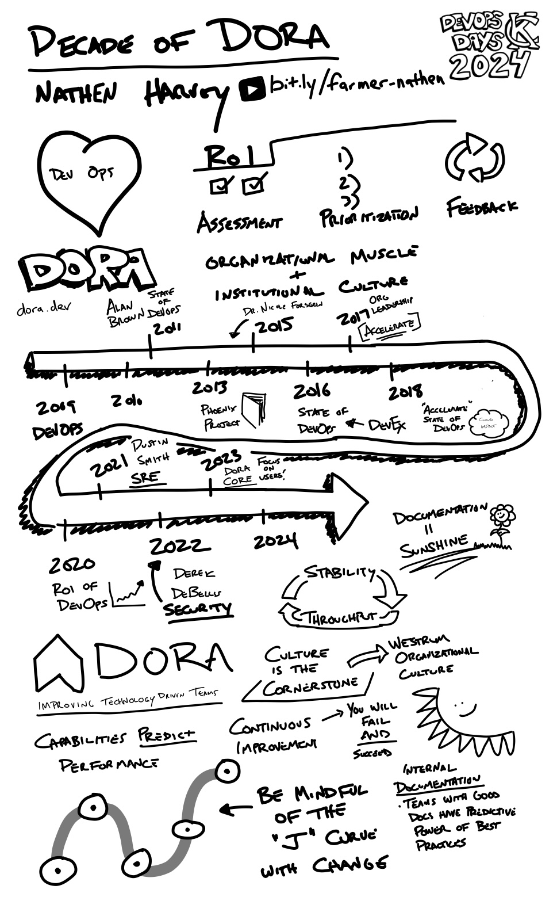

# DevOpsDays KC 2024 Recap

DevOpsDays KC returned this week since 2019! It was awesome to see so many faces I hadn't seen in years. It was a nice two days, at the Madrid Theathre, local food trucks for lunch, and great discussions.

Huge thanks goes out to the organizers for getting this conference re-established in KC! I also liked how the conference was started on Wednesday morning, stating that this event was intended to occur during the middle of the week, so you can share what you learned with others on Friday. Therefore, this is my attempt to help reshare some of my notes and learning from the conference 😀.

## Notes

When listening to talks, I often try to take notes to help me keep focus on what are the key items being shared. I do this intentionally with handwritten style notes, as I can emphasize things quicker with visualizations that assist with my memory. These notes can sometimes be quite hard to read, but I have found myself going back to them when recalling a topic that I know was from a conference. Here are some of my notes here which were larger in size.

### Mastering the Fundamentals: Understanding DevOps in today's world

Talk by: Laura Santamaria ()

### Platform ROI: Why should your company invest?

Talk by: JT Perry ()

### Getting Good (or Better) at Code Review

Talk by: Rhia Dixon ()

###  The 4 Deadly Sins of Mentorship

Talk by: Christina Aldan ()

###  The Automation Firehose: Be Strategic and Tactical

Talk by: Thomas Haver ()

###  A Decade with DORA

Talk by: Nathen Harvey ()

## My Talk

While I attended talks, I was also a speaker on the topic of _Diagramming as Code_. My talk was an Ignite Talk, which are 20 slides, auto-advancing every 15 seconds. If you want to check it out, you can [see the slides here](/talks/diagramming-as-code/).

