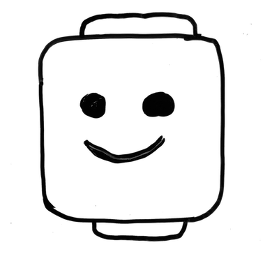

# Drawing 101

I previously posted a set of [design principles about building presentation slides](/post/design-principles-of-the-pptx-language/). In this post, I shared how you can improve the effectiveness of your visual aides, by authoring your own images. This post is going to be a simple starter of how I began including images in my presentations and notes.

## Equipment Required

For this tutorial, I'm using the following equipment:

* Dry erase whiteboard and a black marker
* [iPhone](https://www.apple.com/iphone/) (can be pretty old like mine) and using its built in Camera app
* [Preview app](https://support.apple.com/guide/preview/welcome/mac) on macOS

You can of course use other equipment to do this tutorial, but I wanted to share how I started capturing my images in a very basic way. Hopefully, you can capture the general method that I use, which doesn't take much time at all, and has pretty good results.

## Step 1: Draw something

All of my drawings just started on a dry erase whiteboard. I just use a black marker for high contrast. For this example, I'm making a happy face on a weak resemblance of a LEGO head.

By using a dry erase board, you will be surprised how easy it is to quickly edit your image by erasing small areas and redrawing. You you will then find out how easy it is to combine other drawings, so you start to just draw simple images in isolation, take a photo, then combine them later. This avoids you trying to build some larger complex illustration, and getting frustrated when trying to correct specific areas to complete the overall scene.

## Step 2: Take a photo

I just use the standard Camera app for my iPhone to take photos. When taking photos of the image, I use the _Noir_ photo filter. You can select this by hitting the three circles in the upper-right, then moving the slider to the far-right set of options which will have the _Noir_ label. This is the stronger black and white filter, giving good adjustments on brightness for basic illustrations.

## Step 3: Edit the photo

I transfer my photos to my MacBook using [AirDrop](https://support.apple.com/en-us/HT203106), then I use the standard Preview app that comes with macOS. In Preview, you will then want to show the Markup toolbar, which will give you access to the Instant Alpha tool (i.e. the magic want).

Next, you want to select the background areas of the photo, which you will then delete (by pressing the _Delete_ key). You may ask, "Why are you wanting to delete a white background?" Well, the background actually has several subtle smudges and unnecessary gray content (not completely white), that takes away from the only thing I want show: the drawing. Furthermore, I want a transparent background, so I can then decide when I want to include a white background or not.

After you delete the first segment, you will be prompted to convert the image to support a transparency. Go ahead and click "Convert".

## Enjoy your photo

That's it! Once you have deleted the background out, and possibly removed any other undesirable markings on your drawing, you now can enjoy it.

## Make more from your one drawing

Hopefully this set of notes gets you interested in trying this on your own, and enough to try editing more of your photo. For example, you can easily take what you just built, and make more things from it. Like in this case, I just took that illustration, deleted the smile, copied the right eye, used it for his mouth and expanded it show he was yelling (all within the Preview app).

## Other tools

For those of you who take photos of many illustrations on whiteboard, a great app that can do some of this work to scrub up your photo is [Microsoft Lens](https://itunes.apple.com/us/app/microsoft-office-lens-pdf-scan/id975925059?mt=8). I still do a decent amount of editing of hand drawings through digital editors (much of which, is just through Preview). So, while there are other great apps to use, I thought sharing these common steps of editing with the basic set of apps, keeps you well aware of your options when you need to make adjustments.

Have fun, and start sharing your drawings!

