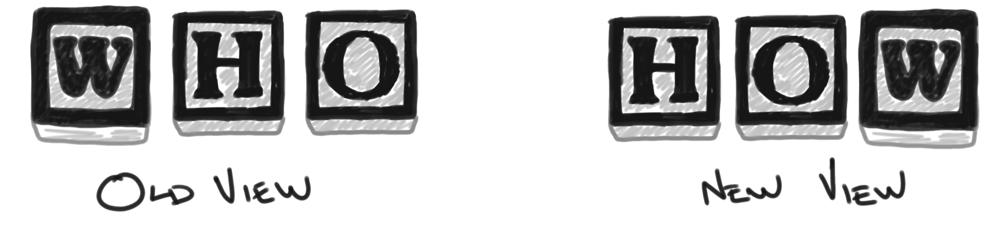

# Seek the Second Story

I recently listened [to a talk](#who-destroyed-three-mile-island) that reminded me of some core lessons on how we can view _"human error,"_ and how it can help us both with our work and personal lives. From that talk, the content from [The Field Guide to Understanding 'Human Error'](https://www.oreilly.com/library/view/the-field-guide/9781317031833/) by [Sidney Dekker](https://en.wikipedia.org/wiki/Sidney_Dekker) is referenced. This book continues to grow as the cornerstone reference on building a safety culture. I wanted to share a short blog post as a refresher on this content, and how we can improve our systems by not looking at _"human error"_ as the cause, but as the symptom of a larger problem.

## Old and New Views

In Sidney Dekker's book, two views are described for looking at _"human error"_. The "Old View" sees it where failure is caused in complex systems by the acts of fallible people. This view sees failure as an unpleasant surprise, not something which should occur. The way failure enters into the system is through people acting in unreliable ways.

The "New View" looks at accidents as being normal. It tries to seek to understand how people made their decisions in these events. It sees _"human error"_ as the starting point for investigation, instead of the conclusion on why something occurred. It also believes that everyone is well-intentioned in their work. This is based on the [local rationality principle](https://en.wikipedia.org/wiki/Principle_of_rationality), which can be described in that we choose to do the rational thing based on what we know about the current situation - what is local to us. This is based on what our current goals are at the time. If something doesn't make sense in doing it by not aligning to our goal, we simply wouldn't do it.

## Biases: Outcome and Hindsight Biases

I love looking at biases. I occasionally hear people describe faults in others by stating how they have a bias, but we all have biases! That's what forms our opinions and decisions. So rather than finding ways to eradicate the perceived existence of biases from our human presence, I like looking at how they influence us and finding ways to signal when they are limiting our abilities. I previously gave [a talk on decision making](), where I felt much of literature I covered related to biases. For the topic of this post, we will look at two biases: outcome and hindsight biases.

### Outcome Bias

The outcome bias is described by Sidney Dekker as:

> Once you know the outcome, it changes your evaluation of decisions that led up to it. If the outcome is bad, then you are not only more willing to judge the decisions, but also more likely to judge them more harshly.

While we would all love the ability to predict the future, this bias can make it challenging when viewing a past decision that resulted in a negative outcome. You have good people with good intentions to support your systems. Good decisions made from good intentions can result in negative outcomes. The inverse of this is also true, where a _bad_ process that is followed can still result in a good outcome. Don't start with the outcome and work backwards to how they made their decision. It drags the context of how this future perspective should have been known (which isn't possible without a time machine). You need to start with what they knew at the time of making their well-intended decision.

### Hindsight Bias

The hindsight bias is described by Sidney Dekker as:

> Finding out about an outcome increases the estimate we make about its likelihood. In other words, as a retrospective reviewer who knows the outcome of an event, you exaggerate your own ability to predict and prevent the outcome - while not even being aware of that bias.

This bias often affects our ability to cleanly look at a decision afterwards. To combat the influences of this bias, we must seek the perspective of the decision makers at that moment in time. What did they know? How did they know about it? More than likely they wouldn't have made the same decision if they knew it would have resulted in a negative outcome. We should recognize that by knowing the resulting outcome, we will tend to elevate the possibility of this potential outcome when assessing the situation. This influencer can limit our ability of learning, as we start judging others as to why they wouldn't have perceived this as being a probable outcome. Rather, try to maximize your learning in seeking what they were experiencing and how they were making decisions during this event. Do this without comparing it to the resulting outcome. Avoid using the words "why" and "who," as those are strong signals that you are judging those in the event. Practice using "what" and "how" to learn more about the event without indicating an individual is to blame in the overall system.

## Looking at both the Blunt and Sharp Ends

Sydney Dekker describes how we can view outcomes as a result of an operational system that is comprised of both a blunt and sharp end. The blunt end is the organization that supports or constrains the actions of the sharp end. The sharp end represents the group of humans that are directly involved in the safety-critical part of the process. The blunt end influences the behavior of the sharp end, though it isn't typically the area of focus. For example, it may encourage the sharp end to hurry up or it may increase the workload the sharp end must manage which can increase its operational stress.  When we look to assess the system, you must look at both parts of this system, knowing that the sharp end is influenced by the blunt end.

### Seeking the Second Story

When you look at a story about _"human error"_, there is one story that can be a simple representation of what occurred. The first story about error, is about someone who did something wrong. To correct the error, you change the person or put in a new rule to attempt to prevent that behavior. However, there is always a second story beneath this first story. It is one that is much more complex, but looks more at the overall system than just an individual. It looks at both the blunt and sharp ends of that system. It includes influences of people, processes, technology, and management.

To learn and understand more about a failure, we should seek the second story. A sip test is if you have found a single root cause that explains the entire outcome, you haven't reached the second story. Dig deeper and look past things which may be only symptoms of the larger problem.

## Who Destroyed Three Mile Island?

These lessons are highlighted in some fantastic story telling by Nickolas Means ([@nmeans](https://twitter.com/nmeans)) in his talk: [Who Destroyed Three Mile Island?](https://www.youtube.com/watch?v=1xQeXOz0Ncs) If you haven't caught this talk before, I highly suggest watching it. Not only does it quickly walk through a series of failures in a high complex system, but you also can gain a lot of knowledge on nuclear reactors (bonus!).



## Conclusion

As humans, we are all fallible. To expect someone to never fail, is depriving them of being human. Learning is how we benefit from our failures, so seek the second story to improve that learning. When you pursue this story, you will signal to others in your organization the importance of these factors, and how the first simple story is never the true reason of how something occurred.

