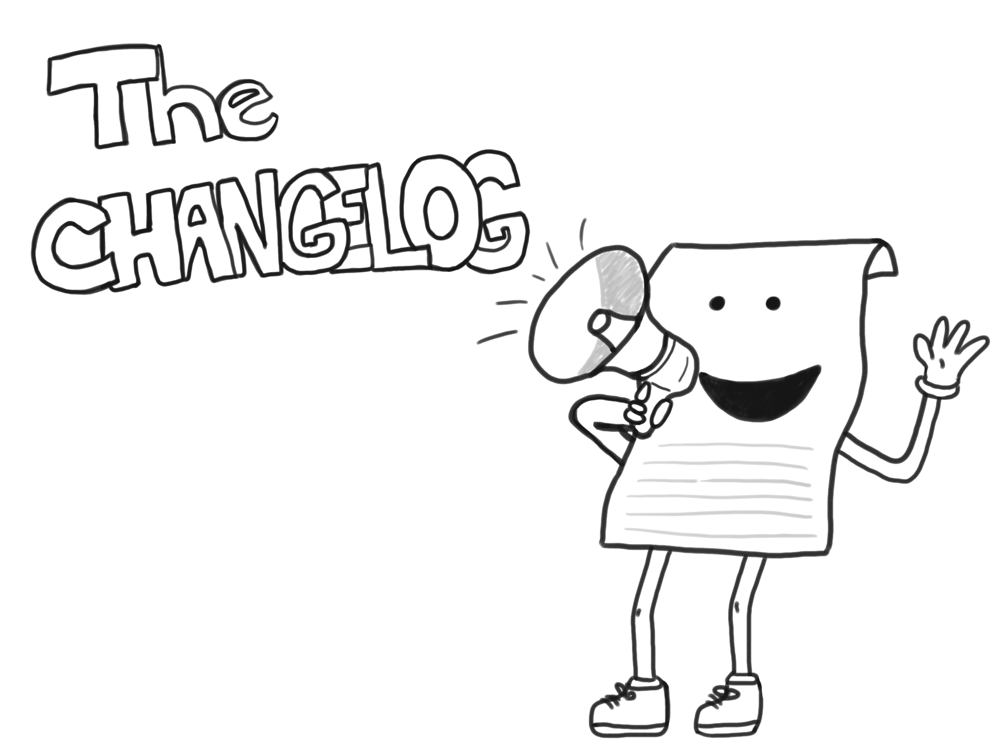

# Share a CHANGELOG

## Introduction

I recently tried a new experiment at work which I'm calling "The CHANGELOG." My goal with this experiment is to improve the communication within my team and with all the product groups I routinely work with. I thought it would be helpful to share some of my notes here on what and why I decided to do it.

## The Name

You may be wondering why I'm calling this "The CHANGELOG." There is of course a reason, and it isn't to convey that I'm yelling due to the capitalization of _CHANGELOG_. It is to model the spirit of a [CHANGELOG file](https://en.wikipedia.org/wiki/Changelog). A CHANGELOG file is a common file that exists in open-source projects, and they are intended to make it very easy for a consumer to read and understand important changes that are occurring. I liked this idea, and wanted this to be part of the name to share the same spirit of what is being communicated.

## The Why

Like a CHANGELOG, you don't want it to be your [git log](https://git-scm.com/book/en/v2/Git-Basics-Viewing-the-Commit-History), a very fine-grained set of events that may not make a lot of sense from the surface without being very familiar with the codebase. It often can take a decent amount of cognitive load to work from a git log description, looking at the file changes, and then understanding what those changes ultimately support. There may be three different git commits that create one logical important thing to know. I see this being similar when something is communicated to humans through series of emails. Something important may be shared that you want to share with others, but if you share it with others, they must do a depth-first search of the email conversation thread and then rewind all of it to understand why it is important. To simplify this, you want the provider of the content to quickly summarize the important topic and _why_ they believe it is important, with the ability to reference the details (if curiosity remains).

From the site [keepachangelog.com](https://keepachangelog.com/en/1.0.0/), they have some reasoning that I think is helpful to share:

> ### Why keep a changelog?
> 
> To make it easier for users and contributors to see precisely what notable changes have been made between each release (or version) of the project.
>
> ### Who needs a changelog?
> 
> People do. Whether consumers or developers, the end users of software are human beings who care about what's in the software. When the software changes, people want to know why and how.

I like this reasoning, in that there is unmistakably work to be done to create a CHANGELOG, but it can deliver a larger benefit from all those that read it to identify what notable changes have occurred. We all have limited time, but if we can put more effort in how we summarize and convey essential context in some of this information, it may greatly help all those that consume the information.

## The Format

The format of this can be viewed a simple series of news posts (ordered by time) on a central site. Since many of us look at life in the lens of software, I thought using the analogy of a CHANGELOG is helpful. The goal is to create a concise summary of notable changes for other people to use and get the benefit. An email notification is then sent to those to consume the content. Rather than this content only being in an email, if others find this information helpful, they can simply cross reference the site (rather than forcing them to forward an email). In the past, I have seen others give a "news email" to their team, and then include another team's "news email" in their email. To avoid that, I'm just making it a site, which has a simple timeline by dates. Each week, you could view it like a release, but I will treat all of them as minor releases (ex. 2020.17), which is `YYYY.ww`, where each minor release is the next week. Don't worry, this **totally** follows [semantic versioning](https://semver.org/) 😄.

I have started doing this for the past couple of weeks, and have received good feedback. Here are some of my observations and feedback so far:

* It has allowed me to avoid repeating news in my 1:1s. By having something shared beforehand, we can then just talk about what is important to them and know there is time for other follow-ups to the items in the news. I feel less of a burden to ensure people are staying well informed, and I feel like it is a more stable communication channel for them to stay up-to-date.
* I have been able to cross-reference content in the site when people ask questions to topics that happen to be shared in the CHANGELOG. This helps indicate to others how to stay subscribed in future weeks by sharing the source of this content versus having to type it out again (or forward a email with a bunch of other content to filter).
* I have had questions from others about the content that shows interest in what is shared, and have heard how people like it to be categorized, so it is easy to quickly capture content that seems applicable to them. Rather than giving it as a list of all things, giving context in categories helps it easier in consuming that content.

## Conclusion

I have found this approach helpful. However, I also recognized that it is an additional amount of time to ensure I capture things throughout the week and get it published routinely in a concise format. What I wanted to avoid was re-sharing items in their raw format without the simple short description of context and takeaway. So, rather than just thinking of it as news that you are sharing with your fellow team members, think of it as a CHANGELOG. A concise format that helps both in lowering the amount of time to produce the content and how much effort it takes to consume it through brief overviews with links to the full source if interest exists.

I encourage you to try sharing your own CHANGELOG. You might realize there are more things are happening in your space than you realized. By giving the added context of why you think something else should be shared, you can help your team stay better aligned on the current events and reduce the repeated costs that others pay when digging for substance in an era of information noise.
