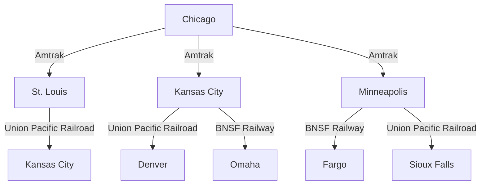
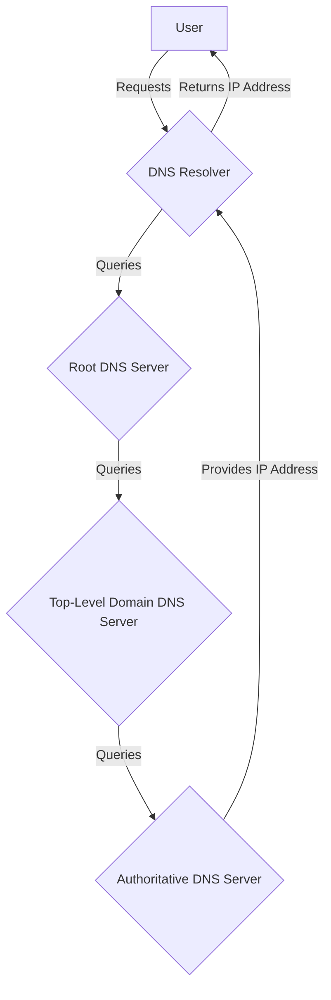
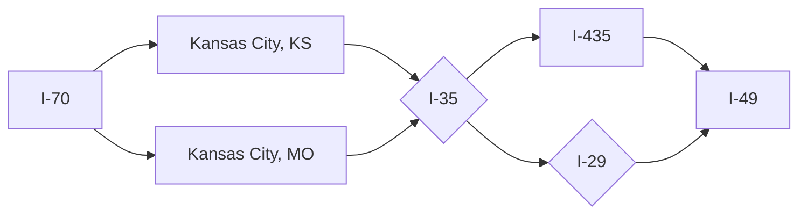
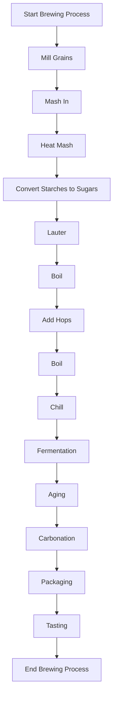
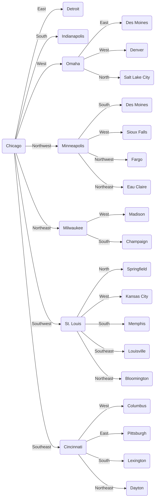

```mermaid
graph TD;
    A[Chicago] -- Amtrak --> B[St. Louis];
    A -- Amtrak --> C[Kansas City];
    A -- Amtrak --> D[Minneapolis];
    B -- Union Pacific Railroad --> E[Kansas City];
    C -- Union Pacific Railroad --> F[Denver];
    C -- BNSF Railway --> G[Omaha];
    D -- BNSF Railway --> H[Fargo];
    D -- Union Pacific Railroad --> I[Sioux Falls];
```

```mermaid
graph TD;
    A[User] -- Requests --> B{DNS Resolver};
    B -- Queries --> C{Root DNS Server};
    C -- Queries --> D{Top-Level Domain DNS Server};
    D -- Queries --> E{Authoritative DNS Server};
    E -- Provides IP Address --> B;
    B -- Returns IP Address --> A;
```

```mermaid
graph LR;
    A[I-70] --> B[Kansas City, KS];
    A --> C[Kansas City, MO];
    B --> D{I-35};
    C --> D;
    D --> E[I-435];
    D --> F{I-29};
    E --> G[I-49];
    F --> G;

```

```mermaid
graph TD;
    A[Start Brewing Process] --> B[Mill Grains];
    B --> C[Mash In];
    C --> D[Heat Mash];
    D --> E[Convert Starches to Sugars];
    E --> F[Lauter];
    F --> G[Boil];
    G --> H[Add Hops];
    H --> I[Boil];
    I --> J[Chill];
    J --> K[Fermentation];
    K --> L[Aging];
    L --> M[Carbonation];
    M --> N[Packaging];
    N --> O[Tasting];
    O --> P[End Brewing Process];
```

```mermaid
graph LR;
    CHI(Chicago) -->|East| DET(Detroit)
    CHI -->|South| IND(Indianapolis)
    CHI -->|West| OMA(Omaha)
    CHI -->|Northwest| MSP(Minneapolis)
    CHI -->|Northeast| MIL(Milwaukee)
    CHI -->|Southwest| STL(St. Louis)
    CHI -->|Southeast| CIN(Cincinnati)
    OMA -->|East| OMADES(Des Moines)
    OMA -->|West| DEN(Denver)
    OMA -->|North| SLC(Salt Lake City)
    MSP -->|South| DSM(Des Moines)
    MSP -->|West| FSD(Sioux Falls)
    MSP -->|Northwest| FGO(Fargo)
    MSP -->|Northeast| EAU(Eau Claire)
    MIL -->|West| MAD(Madison)
    MIL -->|South| CIC(Champaign)
    STL -->|North| SPI(Springfield)
    STL -->|West| KC(Kansas City)
    STL -->|South| MEM(Memphis)
    STL -->|Southeast| LOU(Louisville)
    STL -->|Northeast| BLN(Bloomington)
    CIN -->|West| COL(Columbus)
    CIN -->|East| PIT(Pittsburgh)
    CIN -->|South| LEX(Lexington)
    CIN -->|Northeast| DAY(Dayton)

```