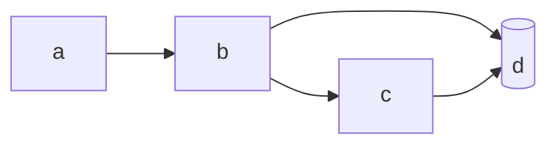
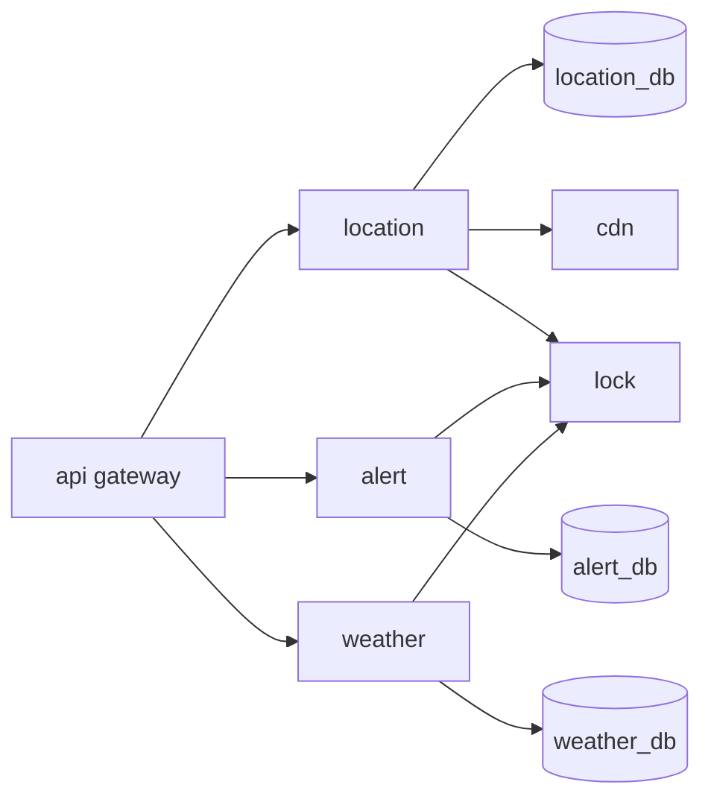

 
     

                <section>
                    

                        <pre>
                          %%{init: {'theme': 'dark', 'themeVariables': { 'darkMode': true }}}%%
                          flowchart LR
                              a[api gateway  ] --> b[location]
                              a --> c[alert]
                              a --> d[weather]
                              b --> id1[(location_db)]
                              b --> f[cdn]
                              c --> id2[(alert_db)]
                              d --> id3[(weather_db)]
                              b & c & d --> e[lock]
                        </pre>
                      

                </section>